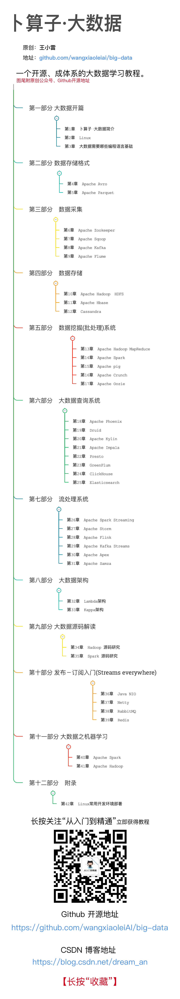

# 第1章 卜算子·大数据简介

“卜算子·大数据”，是一个开源、成体系的大数据学习教程。从基础数据采集到顶层架构设计。最新梳理出大数据知识体系共计12个部分，42个章节。

:star:[**Star**](https://github.com/lycheeman/big-data) [收藏项目](https://github.com/lycheeman/big-data)

- **配套 卜算子·大数据 项目源码**
  - [【GitHub地址】](https://github.com/lycheeman/big-data) https://github.com/lycheeman/big-data-example
  - [【码云地址】](https://gitee.com/machinelearning/big-data-example) https://gitee.com/machinelearning/big-data-example

本章主要内容:
- [x] 特点
- [x] “卜算子·大数据”架构
- [x] 项目更新
- [x] 写作目的
- [x] 原创声明
---
## 1.1 特点

**关于** ——“卜算子·大数据”，其中“卜算子”是中国诗词中唯一包含计算、占卜、预测寓意的词牌名，而后跟的大数据，亦是如此。“卜算子·大数据”合二为一，再合适不过了。

**开源** ——“卜算子·大数据”，是一个开源的大数据教程。所有原创文章与源代码在Github仓库上，地址　https://github.com/lycheeman/big-data　（但是有转载或者引用者要注明作者和来源信息，格式见2.1.5）

**实践出真知** ——从构建到编程，以 ** busuanzi.org ** 为大数据教程实践项目。

**快速上手** ——知识体系构成以”部分”为知识点范畴，以“章”为技能点，以“节”为知识点，从基础数据采集到顶层架构设计。由浅入深，先快速上手构建、再知识点理论、再结合项目实践。

**生态较完整** ——目前最新梳理出大数据相关共计12个部分，42个章节。虽然看起来多，但是和大数据完整生态比起来，只能说正在努力构建生态。

## 1.2　“卜算子·大数据”架构

知识宝贵的地方在于自成体系

需要学习的大数据技能基本都在这里了（大数据生态）

我有信心更完，你有信心学完吗？

[来不及解释了~] 上全图！记得点击**收藏**哦~

### 第一部分 大数据开篇
- 第1章　[卜算子·大数据简介](./chapter1/1.卜算子·大数据简介.md)
- 第2章　Linux
- 第3章　大数据需要哪些编程语言基础

### 第二部分 数据存储格式
- 第4章　Apache Avro
- 第5章　Apache Parquet

### 第三部分　数据存储
- 第10章　Apache Hadoop　HDFS
- 第11章　Apache Hbase
- 第12章　Cassandra

### 第四部分　数据采集
- 第6章　Apache Zookeeper
- 第7章　Apache Sqoop
- 第8章　Apache Kafka
- 第9章　Apache Flume

### 第五部分　数据挖掘(批处理)系统
- 第13章　Apache Hadoop MapReduce
- 第14章　Apache Spark
- 第15章　Apache pig
- 第16章　Apache Crunch
- 第17章　Apache Oozie

### 第六部分　大数据查询系统
- 第18章　Apache Phoenix
- 第19章　Druid
- 第20章　Apache Kylin
- 第21章　Apache Impala
- 第22章　Presto
- 第23章　GreenPlum
- 第24章　ClickHouse
- 第25章　Elasticsearch

### 第七部分　流处理系统
- 第26章　Apache Spark Streaming
- 第27章　Apache Storm
- 第28章　Apache Flink
- 第29章　Apache Kafka Streams
- 第30章　Apache Apex
- 第31章　Apache Samza

### 第八部分　大数据架构
- 第32章　Lambda架构
- 第33章　Kappa架构

### 第九部分 大数据源码解读
- 第34章　Hadoop 源码研究
- 第35章　Spark 源码研究

### 第十部分 发布－订阅入门(Streams everywhere)
- 第36章　Java NIO
- 第37章　Netty
- 第38章　RabbitMQ
- 第39章　Redis

### 第十一部分 大数据之机器学习
- 第40章　Apache Spark
- 第41章　Apache Hadoop

### 第十二部分　附录
- 第42章　Linux常用开发环境部署

获取最新目录地址：https://github.com/lycheeman/big-data

## 1.3 项目更新
每周更新，主要将在Github,CSDN,微信公众号更新。

**busuanzi.org 是“卜算子·大数据”大数据学习教程中的实践项目。**

**Github文章、源码每周更新 https://github.com/lycheeman/big-data**

**CSDN地址文章每周更新 https://blog.csdn.net/dream_an**

**微信公众号“从入门到精通”，第一时间获得教程更新。 搜索“从入门到精通”**

## 1.4　写作目的
**于己**

兴趣、感恩，要感谢大学的两位教授，让我2014年初次接触到了大数据（那时候时基于分布式系统的算法实现项目），对该领域充满了兴趣，时至今日。

经验、知识需要系统沉淀——自2014年接触大数据。目前某股份公司技术经理一枚，从事大数据相关工作。时间长了，虽然不再迷茫，但急需做好系统的沉淀。

坚持、写作，从2015年写博客，没有间断过。也沉淀了一些写作功底和耐心。

开源、分享，具有开源精神，喜欢分享技术。并非大牛，技术不够，诚意来凑，不喜勿喷，一起成长。

**于人**

对大数据感兴趣的同学，有了一个相对系统的教程。

对于想要转行进入大数据领域的同学，多了一份参考、保障。

想在大数据领域深入学习的同学，我们一起成长。

尽量构建比较体系的大数据生态，努力成为大数据学习者在迷茫之中的一份地图。

在公司内部也不时培训大数据新人，努力成为一个合格的引路人。

## 1.５ 原创声明
凡是转载或者摘选作者文章资源者，需要带上原创作者信息与原文Github地址，如下所示
>原创作者：王小雷  
>作品出自：https://github.com/lycheeman/big-data  
>联系邮件：wov@outlook.com

关注“从入门到精通”立即获得教程

