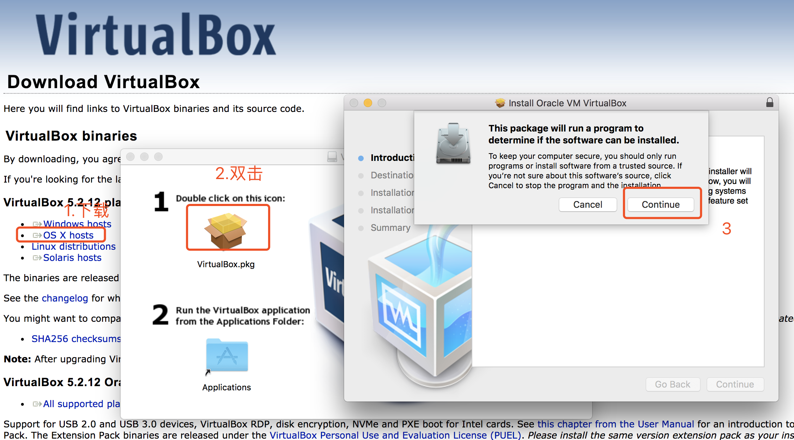
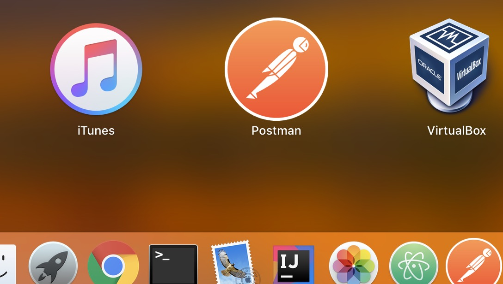
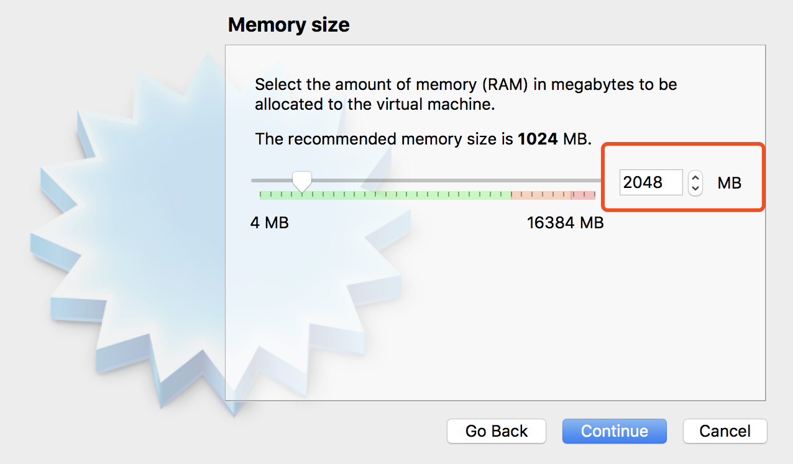
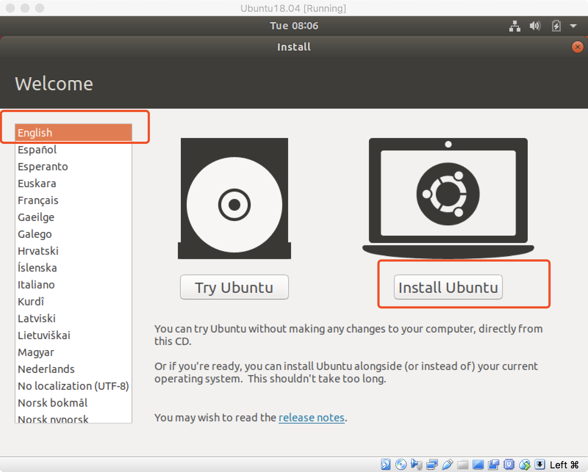
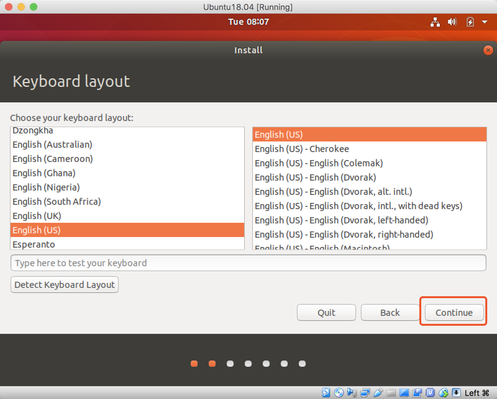
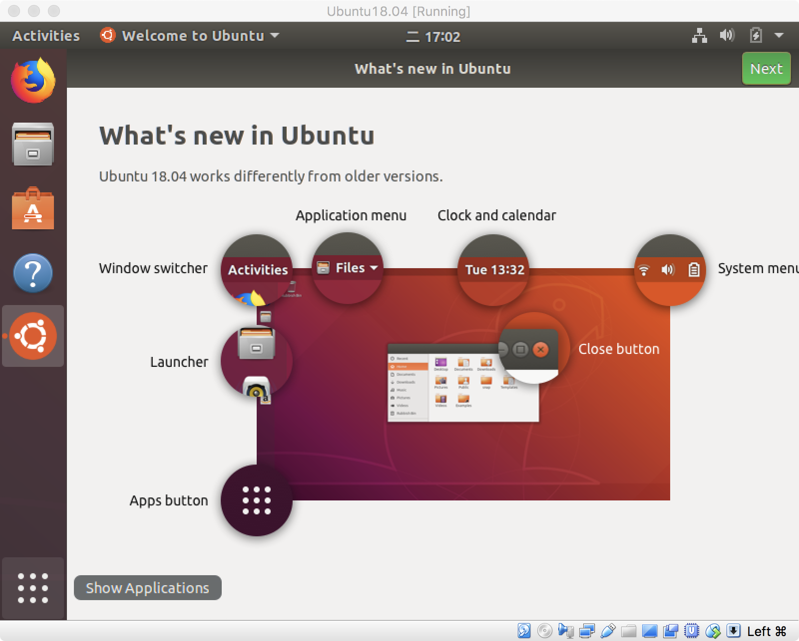

# 2.virtualbox快速入门
## 1.下载virtualbox
### 选择对应的平台下载 https://www.virtualbox.org/wiki/Downloads
 VirtualBox 5.2.12 platform packages
 - Windows hosts（window版本）
 - OS X hosts（Mac版本）
 - Linux distributions（Linux版本）
 - Solaris hosts

## 2.安装virtualbox(记录Mac与Linux平台安装)

- 2.1 **Mac**环境安装
  - 下载 https://www.virtualbox.org/wiki/Downloads
  - 安装virtualbox，如下图
  

  - 打开
  

- 2.2 **Linux**环境安装（Ubuntu18.04）

## 3.下载**Linux**镜像（Ubuntu 18.04或者 debian9.4）

- 下载Ubuntu18.04 桌面版
  - 下载地址（https://mirrors.tuna.tsinghua.edu.cn/ubuntu-releases/18.04/ubuntu-18.04-desktop-amd64.iso）
  - 桌面版可以用来熟悉Linux系统操作，比较友好。大数据程序开发、hadoop伪分布式部署等均可在此系统操作。

- 下载Ubuntu18.04 服务器版（即没有桌面）
  - 下载地址 (https://mirrors.tuna.tsinghua.edu.cn/ubuntu-releases/18.04/ubuntu-18.04-live-server-amd64.iso)
  - 服务器版占用资源少，但是没有界面，需要纯命令行操作，后续大数据开发中，集群部署使用服务器版。

## 4.virtualbox安装Ubuntu18.04桌面版

### 4.1 配置virtualbox

- 4.1.1 Mac环境——virtualbox安装Ubuntu18.04

- 4.1.2 Linux(Ubuntu18.04)环境——virtualbox安装Ubuntu18.04

### 5. Ubuntu18.04安装
#### 5.1.【注意】Mac平台初次加载镜像配置
  - Mac系统中报错（初次安装后，加载镜像报错，因为没有权限）

  - Mac系统中报错解决（在 System Prefences-->Security & Privacy-->General--Allow)允许virtualbox的权限操作。

#### 5.2.【注意】Linux平台初次加载镜像配置

#### 5.3.Ubuntu18.04安装过程
- 1.加载镜像

- 2.选择安装

- 3.选择语言（推荐英文，不容易出一些莫名其妙的错误）

- 4.选择最小安装，取消安装过程中更新（这样安装过程会很快，大概3-4分钟）

- 5.选择清磁盘安装

- 6.确定

- 7.选择时区

- 8.设置用户名和主机名

- 9.等待。。。

- 10.安装完毕需要重启虚拟机，然后重新进入登录，安装完成

#### 至此不论是在Mac还是Linux平台下的virtualbox安装Ubuntu18.04已经完成。

.
