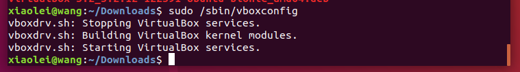
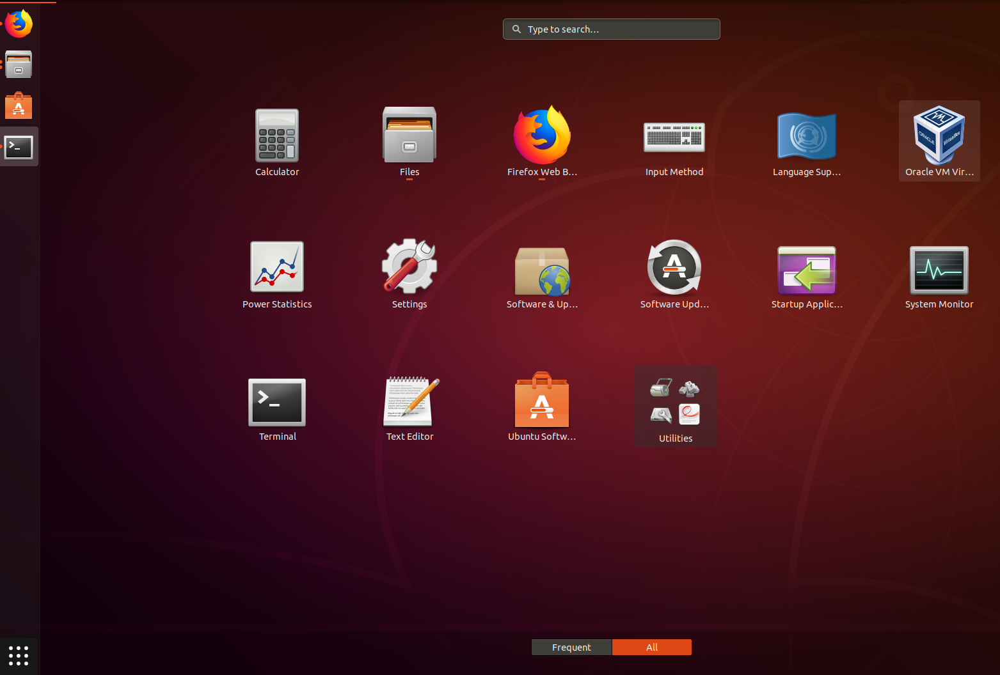

# 1.1 Virtualbox虚拟机快速入门
## 1.1.1 关闭BIOS安全启动项、开启BIOS中允许CPU虚拟选项 下载virtualbox、下载Linux Ubuntu 18.04镜像
### 1.1.1.1 如何关闭 Security boot(安全启动项)?
在计算机启动时进入BIOS设置(F2)——>高级模式(有的笔记本没有高级模式直接能看到“boot”)——>启动(boot)——安全启动——>密室管理——>清除密匙（至此关闭了安全启动项）

### 1.1.1.2 选择对应的平台下载 https://www.virtualbox.org/wiki/Downloads
 VirtualBox 5.2.12 platform packages
 - Windows hosts（window版本）
 - OS X hosts（Mac版本）
 - Linux distributions（Linux版本）
 - Solaris hosts

### 1.1.2 安装virtualbox(记录Mac与Linux平台安装)
### 1.1.3 下载**Linux**镜像（Ubuntu 18.04或者 debian9.4）

- 下载Ubuntu18.04 桌面版
  - 下载地址（https://mirrors.tuna.tsinghua.edu.cn/ubuntu-releases/18.04/ubuntu-18.04-desktop-amd64.iso）
  - 桌面版可以用来熟悉Linux系统操作，比较友好。大数据程序开发、hadoop伪分布式部署等均可在此系统操作。


- 下载Ubuntu18.04 服务器版（即没有桌面）
  - 下载地址 (https://mirrors.tuna.tsinghua.edu.cn/ubuntu-releases/18.04/ubuntu-18.04-live-server-amd64.iso)
  - 服务器版占用资源少，但是没有界面，需要纯命令行操作，后续大数据开发中，集群部署使用服务器版。


### 1.1.2.1 **Mac**环境安装
  - 下载 https://www.virtualbox.org/wiki/Downloads

  - 安装virtualbox，如下图
  

  - 打开
  


### 1.1.2.2  **Linux**环境安装（Ubuntu18.04）

- 在terminal中按顺序执行如下安装命令

```
# 安装必要依赖
sudo apt install gcc make perl

# 通过 dpkg -i 安装下载好的软件包
sudo dpkg -i virtualbox-5.2_5.2.12-122591~Ubuntu~bionic_amd64.deb

# 检查、修复安装过程发生的错误
sudo apt install -f

# 重新启动virtualbox服务
sudo /sbin/vboxconfig
```


- 安装完成后查看




### 1.1.3 配置virtualbox

- 1.1.4.1.1 Mac环境——virtualbox安装Ubuntu18.04


## 1.1.4 【注意】初次（加载镜像）打开已经创建好的虚拟机

### Mac平台
  初次加载镜像配置
  - Mac系统中报错（初次安装后，加载镜像报错，因为没有权限）


  - Mac系统中报错解决（在 System Prefences-->Security & Privacy-->General--Allow)允许virtualbox的权限操作。


### Linux平台（Ubuntu18.04）

如果报错，解决方案：

首先，检查启动安全(security boot)是否开启（开启会报错），如果开启，需要关闭。关闭方法如上1.1.1.1 .

其次，检查安装相关依赖是否安装。方法如上 1.1.2.2所述.

## 1.1.5 Ubuntu18.04安装过程
（注意）

- 1.加载镜像

- 2.选择安装

- 3.选择语言（推荐英文，不容易出一些莫名其妙的错误）

- 4.选择最小安装，取消安装过程中更新（这样安装过程会很快，大概3-4分钟）

- 5.选择清磁盘安装

- 6.确定

- 7.选择时区

- 8.设置用户名和主机名

- 9.等待。。。

- 10.安装完毕需要重启虚拟机，然后重新进入登录，安装完成


#### 至此不论是在Mac还是Linux平台下的virtualbox安装Ubuntu18.04已经完成。


.
