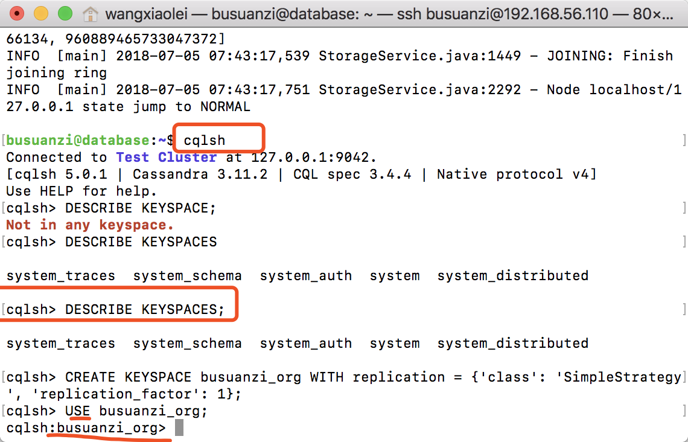

#12.3 Cassandra数据定义

“[卜算子·大数据](https://github.com/lycheeman/big-data)”一个开源、成体系的大数据学习教程。——每周日更新

本节主要内容：

- 数据定义

## 12.3.1 Cassandra Query Language (CQL)
CQL是Cassandra提供的接近SQL的模型，因为数据包含在行列的表中，CQL中的表，行，列的定义与SQL是相同的。

## 12.3.2 启动cqlsh

```sh
cqlsh
```

## 12.3.3 Clusters 集群

集群是Cassandra集群部署的名称标志，避免集群A中的机器加入其它的集群（如B）。

## 12.3.4 Keyspaces 键空间

键空间（Keyspace）是表的容器。

查看当前有哪些键空间可用。
```SQL
DESCRIBE KEYSPACES
```
创建键空间
```SQL
CREATE KEYSPACE busuanzi_org WITH replication = {'class': 'SimpleStrategy', 'replication_factor': 1};
```
选择键空间

```SQL
USE busuanzi_org;
```

删除键空间

```SQL
Drop keysapce_name
```

## 12.3.5 tables 表

创建 busuanzi.org 创建表
```SQL
CREATE TABLE busuanzi_org.top_n_url (
    username text,
    projects text,
    star_number int,
    comment text static,
    PRIMARY KEY ((username, projects), star_number)
);
```
插入数据
```SQL
INSERT INTO busuanzi_org.top_n_url (username, projects, star_number, comment) VALUES ('wangxiaolei', 'big-data', 89, 'old');
INSERT INTO busuanzi_org.top_n_url (username, projects, star_number, comment) VALUES ('wangxiaolei', 'big-data', 101, 'new');
INSERT INTO busuanzi_org.top_n_url (username, projects, star_number, comment) VALUES ('wangxiaolei', 'machine-learning', 10, 'good');
INSERT INTO busuanzi_org.top_n_url (username, projects, star_number, comment) VALUES ('wangxiaolei', 'machine-learning', 78, 'nice');
INSERT INTO busuanzi_org.top_n_url (username, projects, star_number, comment) VALUES ('zhangsan', 'machine-learning', 1, 'ok');
```

查询top_n_url

```SQL
cqlsh:busuanzi_org> SELECT * FROM top_n_url ;

 username    | projects         | star_number | comment
-------------+------------------+-------------+---------
 wangxiaolei |         big-data |          89 |     new
 wangxiaolei |         big-data |         101 |     new
    zhangsan | machine-learning |           1 |      ok
 wangxiaolei | machine-learning |          10 |    nice
 wangxiaolei | machine-learning |          78 |    nice

(5 rows)
```


## 12.3.6 Cloumns 列

列和关系型数据有类似的地方为可以定义字段类型，区别在还可以定义主键和静态。

### 12.3.6.1 主键（The Primay key ）

主键和关系型数据库的主键类似，具有唯一与检索等属性。在Cassandra中，主键的区别是，主键由两部分组成：

  - 分区键（partition key），主键第一个或者第一组是分区键。
  - 聚类键（clustering cloumns），主键的第二个及之后的键为聚类键。

busuanzi.org案例表中，查询出，row1,row2具有相同分区，row4,ro5具有相同分区，row3单独分区。

### 12.3.6.2 静态（static）
静态的列将会将数值分享给该分区其他的行。（就是说一个分区中，所有行的静态列的值相同）
静态的限制：

- 表中没有聚类键，不可以有静态（因为每一个分区都是唯一的行，所以每个列本质上是静态）的列。
- 主键的列，不可以是静态。
- 表的属性是COMPACT STORAGE的不能有静态的列。
总结，只有存在聚类的时候，非主键的列可以是静态的列，并且该表不是COMPACT STORAGE属性。

busuanzi.org案例表中，查询出，在同一分区中，静态列"comment"中，"new"替换了"old"，"nice"替换了"good"。

:clap:本节完成

长按关注**从入门到精通**


**开源、源码获取**   https://github.com/lycheeman/big-data


---

:izakaya_lantern:**拓展部分**

:izakaya_lantern:**No appropriate python interpreter found.**

cqlsh 需要系统安装python2.7，而ubuntu18.04 server版默认安装的是Python3
cqlsh localhost
No appropriate python interpreter found.

**解决**

```sh
sudo apt install python
```
