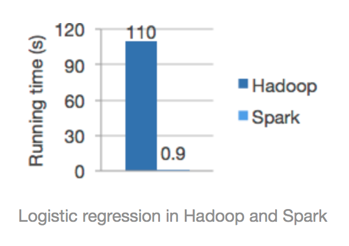

# 14.1 Apache Spark 简介快速入门

“[卜算子·大数据](https://github.com/lycheeman/big-data)”一个开源、成体系的大数据学习教程。——每周日更新

本节主要内容：

- 速度
- 简单易用
- Spark架构
- 到处运行
- 多种数据源

## 14.1.1 速度
百倍的运行速度。

Spark使用先进的DAG调度系统，查询优化器与物理执行引擎，实现了批处理与流处理的高性能。

## 14.1.2 简单易用、支持开发语言丰富
```scala
df = spark.read.json("logs.json") df.where("age > 21")   .select("name.first").show()
```
支持的开发语言：Scala、Java、Python、R语言、SQL

## 14.1.3 Spark架构

Spark是大规模数据处理的统一分析引擎。

Spark顶层架构


Spark 保护的主要模块有四部分 Spark SQL，Spark Streaming，MLlib（机器学习），GraphX（图计算）。


- Spark SQL是处理结构化数据的模块。可以使得开发人员使用SQL语句做数据挖掘。简单、强大。

- Spark Streaming
可以轻松构建可扩展的容错流应用程序。可以实时处理数据，是构建实时大数据处理应用核心。

- MLlib（Machine Learning）是可扩展的机器学习库。聚类、分类等封装好的算法大幅降低机器学习与大数据应用结合的难度。方便、易用，。

- GraphX（graph）用于图像与图像并行计算。

## 14.1.4 到处运行

使用Spark开发的应用程序，可以在多处运行。
支持Spark应用发布的有：

- Hadoop（hadoop YARN）
- Apache Mesos
- Kubernetes
- standalone（Spark自身的独立部署模式）


## 14.1.5 多种数据源
支持多中数据源  HDFS, Apache Cassandra, Apache HBase, Apache Hive, 关系型数据库，以及数百个其他数据源。


:white_check_mark:本节完成

长按关注**从入门到精通**


**源码获取**   https://github.com/lycheeman/big-data
