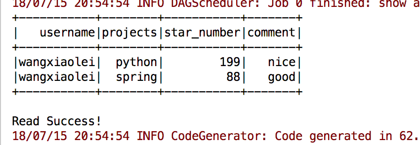
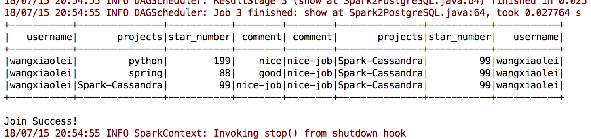
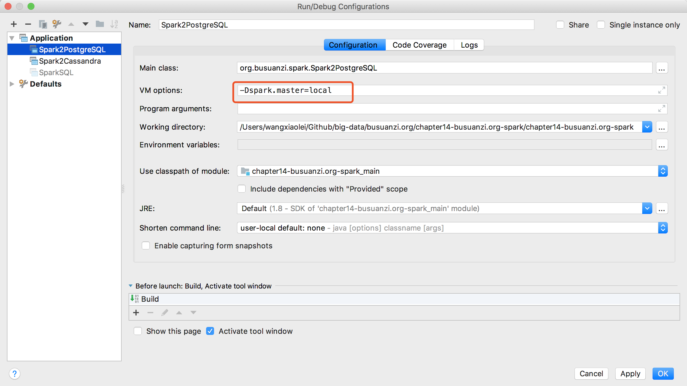

# 14.3 Spark-SQL基于PostgreSQL数据分析编程实例

“[卜算子·大数据](https://github.com/wangxiaoleiAI/big-data)”一个开源、成体系的大数据学习教程。——每周日更新

本节主要内容：

Spark对PostgreSQL数据源数据的处理，通过Spark SQL对结构化数据进行数据分析。

- 创建Gradle项目，引入依赖
- 创建连接
- 读数据库
- 写数据库

[完整源码Spark2PostgreSQL.java](https://github.com/wangxiaoleiAI/big-data/tree/master/busuanzi.org/chapter14-busuanzi.org-spark/chapter14-busuanzi.org-spark/src/main/java/org/busuanzi/spark/Spark2PostgreSQL.java)

[完整项目源码](https://github.com/wangxiaoleiAI/big-data/tree/master/busuanzi.org/chapter14-busuanzi.org-spark/chapter14-busuanzi.org-spark)

## 14.3.1 引入依赖

```Gradle
compile group: 'org.apache.spark', name: 'spark-core_2.11', version: '2.3.1'
compile group: 'org.apache.spark', name: 'spark-sql_2.11', version: '2.3.1'
compile group: 'org.postgresql', name: 'postgresql', version: '42.2.2'
```


## 14.3.2 创建Spark Session与数据库连接参数
```JAVA
SparkSession spark = SparkSession
        .builder()
        .appName("Java Spark SQL basic example")
//                .config("spark.some.config.option", "some-value")
        .getOrCreate();

Properties connectionProperties = new Properties();
connectionProperties.put("user", "busuanzi");
connectionProperties.put("password", "wxl123");
```
## 14.3.3 读取数据库
```JAVA
Dataset<Row> jdbcDF2 = spark.read()
        .jdbc("jdbc:postgresql://192.168.56.110:5432/busuanzidb", "public.top_projects", connectionProperties);

jdbcDF2.show();
```



## 14.3.4 写入数据库
```JAVA
myDF2.write()
        .mode(SaveMode.Append)
        .jdbc("jdbc:postgresql://192.168.56.110:5432/busuanzidb", "public.top_projects", connectionProperties);
```
查询数据库中，可见已经写入成功了。

## 14.3.5 Spark JOIN 操作
```JAVA
spark.sql("SELECT * FROM onev r JOIN twov s ON r.username = s.username")
        .show();
```


[完整源码Spark2PostgreSQL.java](https://github.com/wangxiaoleiAI/big-data/tree/master/busuanzi.org/chapter14-busuanzi.org-spark/chapter14-busuanzi.org-spark/src/main/java/org/busuanzi/spark/Spark2PostgreSQL.java)

[完整项目源码](https://github.com/wangxiaoleiAI/big-data/tree/master/busuanzi.org/chapter14-busuanzi.org-spark/chapter14-busuanzi.org-spark)

## 14.3.6 在IDEA运行项目设置


:white_check_mark:本节完成

长按关注**从入门到精通**


**源码获取**   https://github.com/wangxiaoleiAI/big-data
