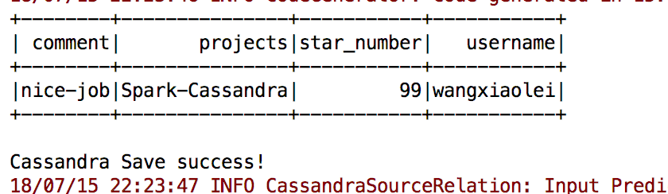
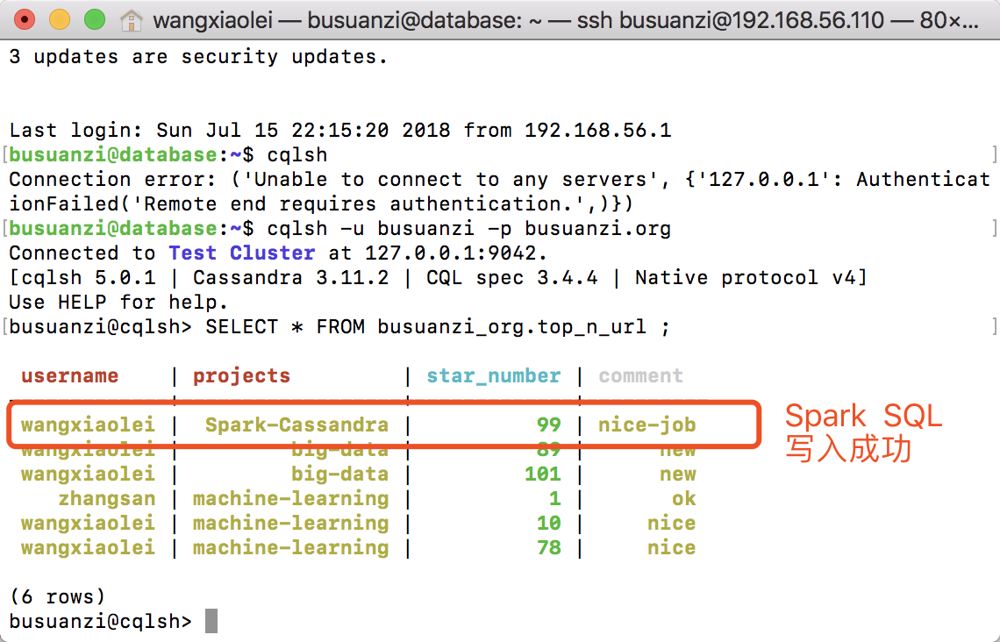
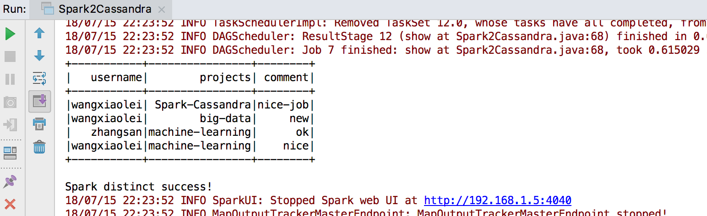

# 14.4 Spark-SQL基于Cassandra数据分析编程实例

“[卜算子·大数据](https://github.com/wangxiaoleiAI/big-data)”一个开源、成体系的大数据学习教程。——每周日更新

本节主要内容：

Spark对Canssandra数据库数据的处理，通过Spark SQL对结构化数据进行数据分析。

- 创建Gradle项目，引入依赖
- 创建Spark Session连接
- 写入Cassandra数据库
- 读取Cassandra数据库
- Spark注册SQL 临时视图执行Distinct操作

[完整源码Spark2Cassandra.java](https://github.com/wangxiaoleiAI/big-data/tree/master/busuanzi.org/chapter14-busuanzi.org-spark/chapter14-busuanzi.org-spark/src/main/java/org/busuanzi/spark/Spark2Cassandra.java)

[完整项目源码](https://github.com/wangxiaoleiAI/big-data/tree/master/busuanzi.org/chapter14-busuanzi.org-spark/chapter14-busuanzi.org-spark)

## 14.3.1 引入依赖

```GRADLE
compile group: 'org.apache.spark', name: 'spark-core_2.11', version: '2.3.1'
compile group: 'org.apache.spark', name: 'spark-sql_2.11', version: '2.3.1'
compile group: 'com.datastax.spark', name: 'spark-cassandra-connector_2.11', version: '2.3.0'
```

## 14.3.2 创建Spark Session

```JAVA
SparkSession spark = SparkSession
        .builder()
        .appName("Java Spark SQL basic example")
//            .config("spark.some.config.option", "some-value")
        .config("spark.cassandra.connection.host", "192.168.56.110")
        .config("spark.cassandra.auth.username", "busuanzi")
        .config("spark.cassandra.auth.password", "busuanzi.org")
        .config("spark.cassandra.connection.port", "9042")
        .getOrCreate();
```

## 14.3.3 写入Cassandra数据库表

```JAVA
ds1.write()
        .format("org.apache.spark.sql.cassandra")
        .options(new HashMap<String, String>() {
            {
                put("keyspace", "busuanzi_org");
                put("table", "top_n_url");
            }
        }).mode("append").save();
```


查询Canssandra数据库



## 14.3.4 读取Cassandra数据库表
```JAVA
Dataset<Row> ds = spark.read()
        .format("org.apache.spark.sql.cassandra")
        .options(new HashMap<String, String>(){
            {
                put("keyspace", "busuanzi_org");
                put("table", "top_n_url");
            }
        }).load();
ds.show();
```


## 14.3.5 Spark SQL Distinct去重
将ds DataFrame注册为SQL临时视图

```JAVA
ds.createOrReplaceTempView("dsv");
```
Spark SQL去重
```JAVA
ds.select("username", "projects", "comment").distinct().show();
```




[完整源码Spark2Cassandra.java](https://github.com/wangxiaoleiAI/big-data/tree/master/busuanzi.org/chapter14-busuanzi.org-spark/chapter14-busuanzi.org-spark/src/main/java/org/busuanzi/spark/Spark2Cassandra.java)

[完整项目源码](https://github.com/wangxiaoleiAI/big-data/tree/master/busuanzi.org/chapter14-busuanzi.org-spark/chapter14-busuanzi.org-spark)


## 14.3.6 在IDEA运行项目设置


:white_check_mark:本节完成

长按关注**从入门到精通**


**源码获取**   https://github.com/wangxiaoleiAI/big-data
