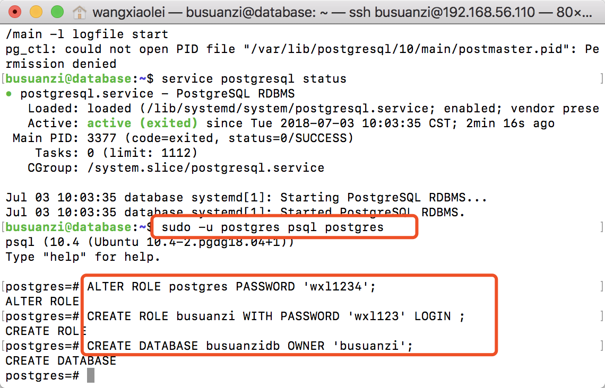
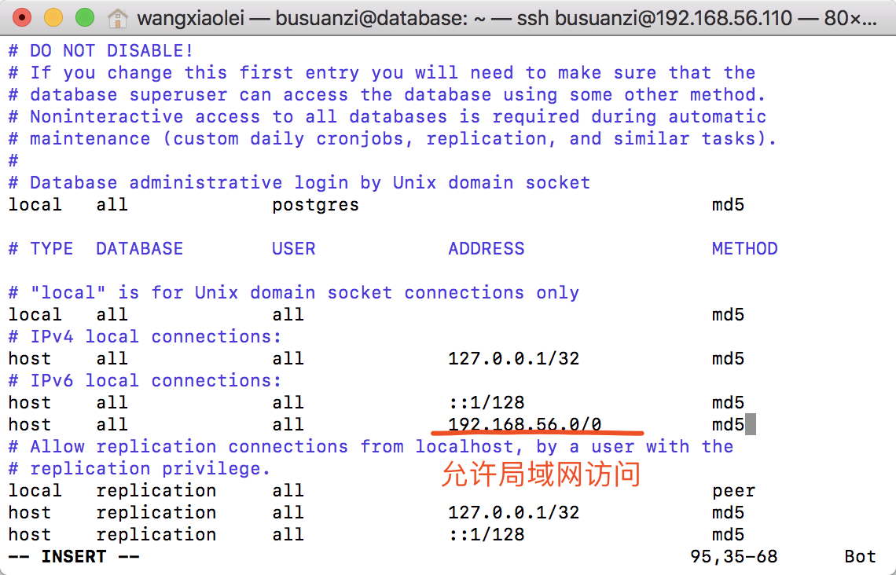
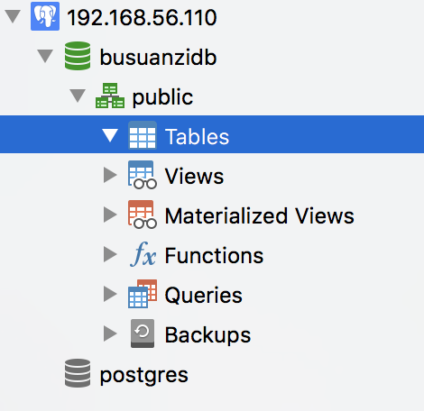

# 2.5 Linux中安装数据库Postgresql

“[卜算子·大数据](https://github.com/lycheeman/big-data)”一个开源、成体系的大数据学习教程。——每周日更新

本节主要内容：

- 创建一台database虚拟机（本章称为服务器）
- 安装PostgreSQL

## 2.5.1 创建Database服务器Ubuntu18.04server
- Hostname为database
- Username为busuanzi
- 静态IP地址为192.168.56.110

详细创建服务器步骤见第二章 Linux，关键步骤如下。


## 2.5.1 安装PostgreSQL
```sh
 sudo vim /etc/apt/sources.list.d/pgdg.list
 ```

```sh
deb http://apt.postgresql.org/pub/repos/apt/ bionic-pgdg main
```
```sh
wget --quiet -O - https://www.postgresql.org/media/keys/ACCC4CF8.asc | sudo apt-key add -
sudo apt update
```

```sh
sudo apt install postgresql-10
```
## 2.5.3 登录Postgresql、修改密码、创建新用户、新数据库
登录Postgresql
```sh
sudo -u postgres psql postgres
```
修改密码
```sh
ALTER ROLE postgres PASSWORD 'wxl1234' ;
```
创建新用户、新数据库
```sh
CREATE ROLE busuanzi WITH PASSWORD 'wxl123' LOGIN ;
CREATE DATABASE busuanzidb OWNER 'busuanzi';
```

退出
```sh
\q
```
## 2.5.4 允许远程登录
修改postgresql.conf
```sh
sudo vim /etc/postgresql/10/main/postgresql.conf
```
修改内容如下
```sh
listen_addresses = '*'
```
修改pg_hba.conf
```sh
sudo vim /etc/postgresql/10/main/pg_hba.conf
```
修改内容如下
```sh
local   all             postgres                                md5

# TYPE  DATABASE        USER            ADDRESS                 METHOD

# "local" is for Unix domain socket connections only
local   all             all                                     md5
# IPv4 local connections:
host    all             all             127.0.0.1/32            md5
# IPv6 local connections:
host    all             all             ::1/128                 md5
host    all             all             192.168.56.0/0          md5
# Allow replication connections from localhost, by a user with the
# replication privilege.
local   replication     all                                     peer
host    replication     all             127.0.0.1/32            md5
host    replication     all             ::1/128                 md5
```


重启postgresql服务

```sh
sudo service postgresql restart
```

## 2.5.5 postgres安装、配置完毕，使用客户端即可连接数据库。



 本节完成

长按关注**从入门到精通**


## 2.5.6 PostgreSQL地址

```sh
jdbc:postgresql://192.168.56.110:5432/busuanzidb
```

**开源、源码获取**   https://github.com/lycheeman/big-data
