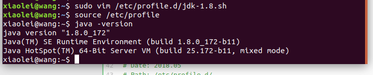
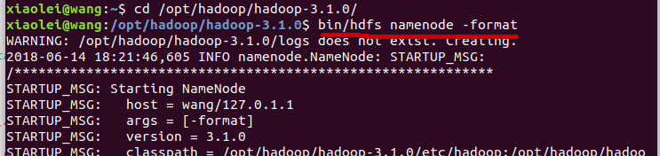
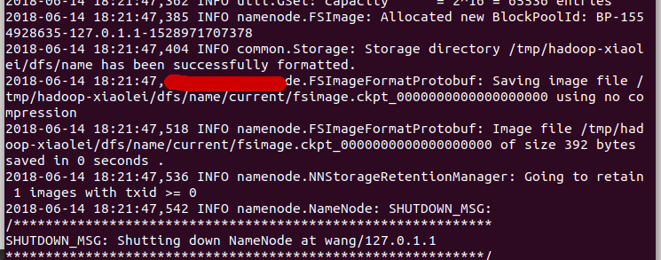
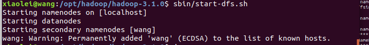
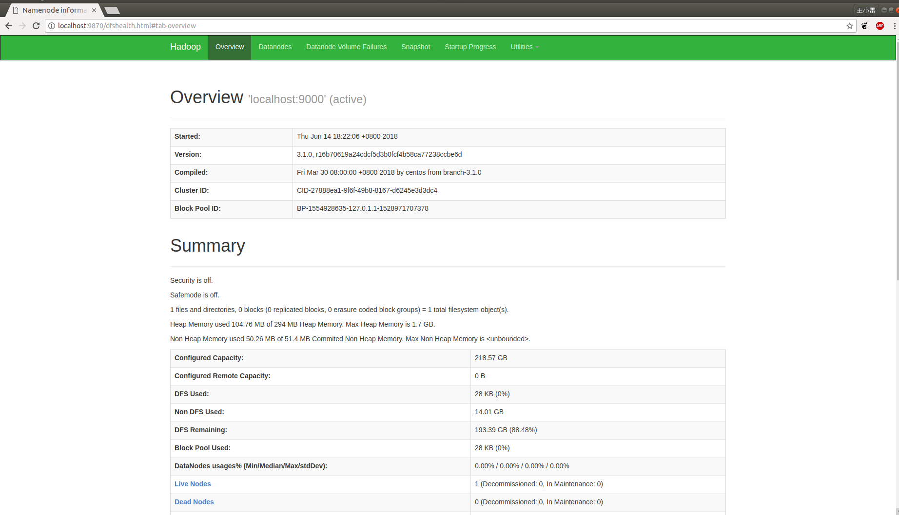
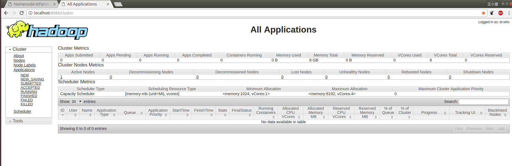

# 2.1 Hadoop伪分布式安装部署

>开源地址 https://github.com/wangxiaoleiAI/big-data
>
[卜算子·大数据 目录](./../../README.md)
>
开源“卜算子·大数据”系列文章、源码，面向大数据（分布式计算）的编程、应用、架构——每周更新！Linux、Java、Hadoop、Spark、Sqoop、hive、pig、hbase、zookeeper、Oozie、flink...etc


本节介绍如何在Linux系统中快速安装Hadoop伪分布式部署（[1.1 Virtualbox虚拟机快速入门](./../chapter1/1.1virtualbox-quick-start.md) 在vitualbox中安装Ubuntu18.04）

## 2.1.1 前期准备

### 1. 下载最新版本Hadoop3.1.0

下载地址
https://mirrors.tuna.tsinghua.edu.cn/apache/hadoop/common/hadoop-3.1.0/hadoop-3.1.0.tar.gz

也可以通过wget命令行下载
```
wget https://mirrors.tuna.tsinghua.edu.cn/apache/hadoop/common/hadoop-3.1.0/hadoop-3.1.0.tar.gz
```
### 2. 安装Java

- 准备文件

```
# 创建jdk文件夹
sudo mkdir -p /opt/java

# 进入Downloads文件夹
cd ~/Downloads

# 通过wget下载
wget --no-check-certificate --no-cookies --header "Cookie: oraclelicense=accept-securebackup-cookie" http://download.oracle.com/otn-pub/java/jdk/8u172-b11/a58eab1ec242421181065cdc37240b08/jdk-8u172-linux-x64.tar.gz

# 解压
tar -zxf jdk-8u172-linux-x64.tar.gz

# 将jdk文件夹移动到/opt/java/
sudo mv jdk1.8.0_172/ /opt/java/jdk1.8.0_172/
```

- 配置Java变量文件[源码](./../../code/chapter2/2.1hadoop-single-cluster)

1.通过vim创建jdk-1.8.sh文件
```
sudo vim /etc/profile.d/jdk-1.8.sh
```
2.添加如下内容
```
#!/bin/sh
# Author:wangxiaolei 王小雷
# Blog: http://blog.csdn.net/dream_an
# Github: https://github.com/wangxiaoleiai
# Date: 2018.05
# Path: /etc/profile.d/

export JAVA_HOME=/opt/java/jdk1.8.0_172
export JRE_HOME=${JAVA_HOME}/jre
export CLASSPATH=.:${JAVA_HOME}/lib:${JRE_HOME}/lib
export PATH=${JAVA_HOME}/bin:$PATH
```
3.让Java变量生效
```
source /etc/profile
```
4.查看已配置完成的Java
```
java -version
```



### 3. 安装ssh rsync
```
sudo apt-get install ssh
sudo apt-get install rsync
```
### 4. 免密码登录

```
# 创建ssh密匙，执行如下命令后回车到底
ssh-keygen -t rsa
# 将产生的公共密匙追加到authorized_keys
cat ~/.ssh/id_rsa.pub >> ~/.ssh/authorized_keys
# 尝试免密码登录（初次登录会询问然后需要输入yes，二次登录可以直接登录）配置成功
ssh localhost
```

## 2.1.2 伪分布式——在配置文件中添加如下内容（[源码](./../../code/chapter2/2.1hadoop-single-cluster)）

1. etc/hadoop/hadoop-env.sh

```
export JAVA_HOME=/opt/java/jdk1.8.0_172
```

2. etc/hadoop/core-site.xml

```
<configuration>
    <property>
        <name>fs.defaultFS</name>
        <value>hdfs://localhost:9000</value>
    </property>
</configuration>

```

3. etc/hadoop/hdfs-site.xml
```
<configuration>
    <property>
        <name>dfs.replication</name>
        <value>1</value>
    </property>
</configuration>
```

## 2.1.3 伪分布式——执行

1. 格式化(注意格式化只需要执行一次即可)
```
bin/hdfs namenode -format
```




2. 开启NameNode和DataNode

```
sbin/start-dfs.sh
```



3. jps查看启动成功

```
jps
```


4. 浏览器访问namenode  http://localhost:9870/

**注意，自Hadoop3.0之后，http://localhost:5007/ 变成http://localhost:9870/** [官方解释](https://issues.apache.org/jira/browse/HDFS-9427)




5. 拓展——Hadoop哪些端口在3.0之后被改掉

```
Namenode ports
----------------
50070 --> 9070
50470 --> 9470

Datanode ports
---------------
50010 --> 9010
50020 --> 9020
50075 --> 9075
50475 --> 9475

Secondary NN ports
---------------
50090 --> 9090
50091 --> 9091
```

## 2.1.4 YARN伪分布式文件配置 [源码](./../../code/chapter2/2.1hadoop-single-cluster)

1. etc/hadoop/mapred-site.xml:

```
<configuration>
    <property>
        <name>mapreduce.framework.name</name>
        <value>yarn</value>
    </property>
    <property>
        <name>mapreduce.application.classpath</name>
        <value>$HADOOP_MAPRED_HOME/share/hadoop/mapreduce/*:$HADOOP_MAPRED_HOME/share/hadoop/mapreduce/lib/*</value>
    </property>
</configuration>
```

2. etc/hadoop/yarn-site.xml:

```
<configuration>
    <property>
        <name>yarn.nodemanager.aux-services</name>
        <value>mapreduce_shuffle</value>
    </property>
    <property>
        <name>yarn.nodemanager.env-whitelist</name>
        <value>JAVA_HOME,HADOOP_COMMON_HOME,HADOOP_HDFS_HOME,HADOOP_CONF_DIR,CLASSPATH_PREPEND_DISTCACHE,HADOOP_YARN_HOME,HADOOP_MAPRED_HOME</value>
    </property>
</configuration>
```

## 2.1.5 启动YARN

1. 启动YARN
```
sbin/start-yarn.sh
```

2. 使用jps查看启动情况
```
jps
```


3. 浏览器访问ResourceManager  http://localhost:8088/



至此，伪分布式部署完成。

## 2.1.6 停止伪分布式后台进程

1. 停止YARN

```
sbin/stop-yarn.sh
```

2. 停止Namenode和Datanode

```
sbin/stop-dfs.sh
```

## 2.1.7 如果要清除Hadoop，彻底删除Hadoop相关文件与配置

```
rm -rf /opt/hadoop/hadoop-3.1.0/logs/*
rm -rf /tmp/hadoop*
```
.
