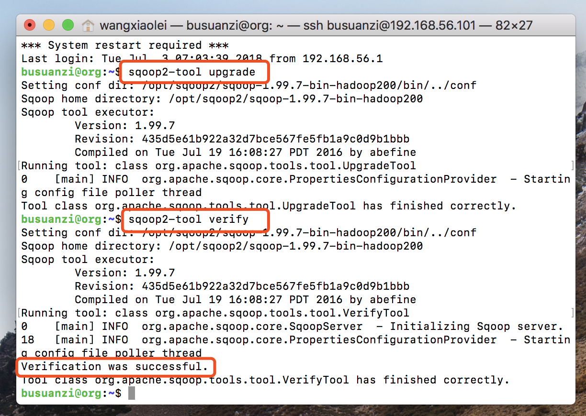
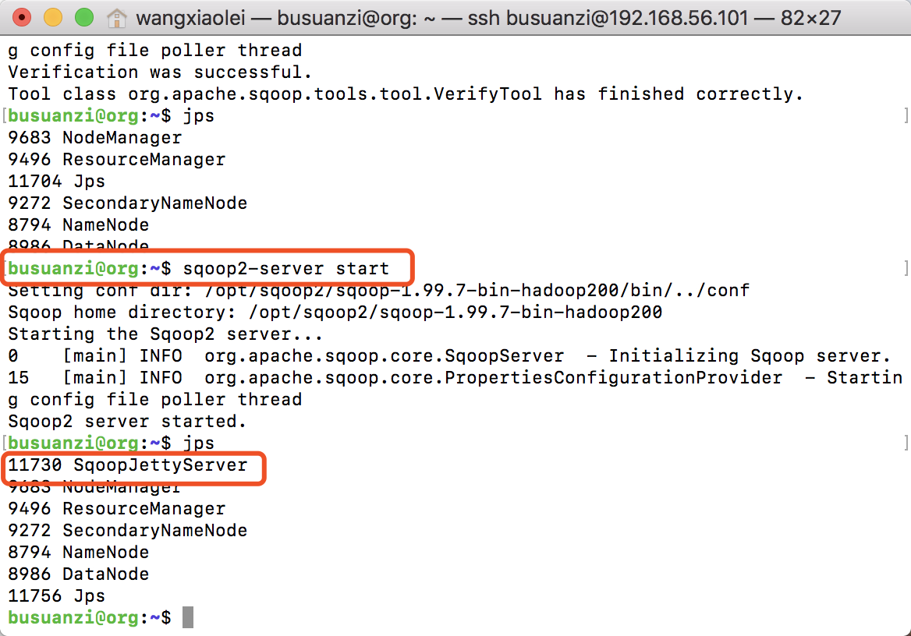
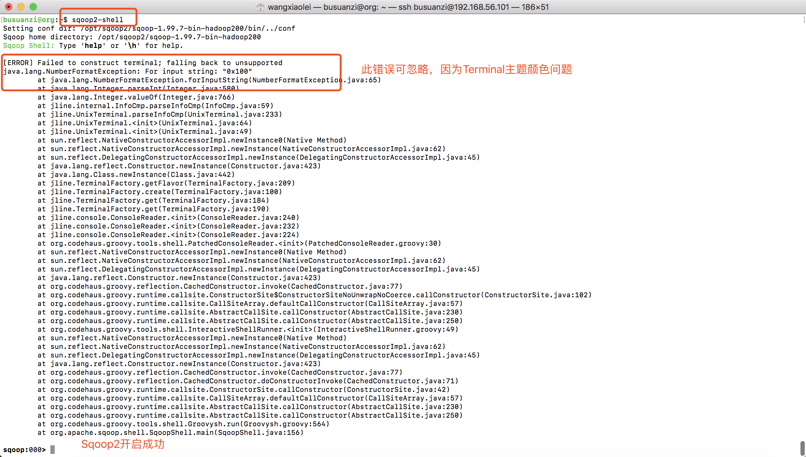

# 7.2 Sqoop2安装
“[卜算子·大数据](https://github.com/lycheeman/big-data)”一个开源、成体系的大数据学习教程。——每周日更新

本节主要内容：

- Sqoop2环境变量设置
- Sqoop2配置文件修改
- Sqoop2数据库初始化与验证
- 开启Sqoop2
- 关闭Sqoop2

在此之前已经部署好Hadoop（伪分布式或者完全分布式），并设置了Hadoop环境变量（参考第二章 Linux）。

## 7.2.1 Sqoop环境变量设置
```sh
sudo vim /etc/profile.d/sqoop-2.sh
```

```sh
#!/bin/sh
# Author:wangxiaolei(王小雷)
# Blog: http://blog.csdn.net/dream_an
# Github: https://github.com/lycheeman
# Date:201807

export SQOOP_HOME=/opt/sqoop2/sqoop-1.99.7-bin-hadoop200
export PATH=$SQOOP_HOME/bin:$PATH
export SQOOP_SERVER_EXTRA_LIB=/var/lib/sqoop2/
```

## 2.7.2 Sqoop2配置文件修改
修改conf/sqoop.properties
```sh
org.apache.sqoop.submission.engine.mapreduce.configuration.directory=/opt/hadoop/hadoop-3.1.0/etc/hadoop/conf/
```

## 2.7.3 Sqoop2数据库初始化与验证
Sqoop2数据库初始化

```sh
sudo mkdir /var/lib/sqoop2
sudo chown busuanzi:busuanzi /var/lib/sqoop2/
mkdir /var/lib/sqoop2/data
mkdir /var/lib/sqoop2/extra-lib
```

```sh
sqoop2-tool upgrade
```
验证
```sh
sqoop2-tool verify
```


sqoop2-server start
## 2.7.4 开启Sqoop2

```sh
sqoop2-server start
```
查看
```sh
jps
```


## 2.7.5 添加数据库驱动

将数据库驱动放置
```sh
cp postgresql-42.2.2.jar /var/lib/sqoop2/extra-lib/
```

## 2.7.6 Sqoop2客户端
开启Sqoop2客户端
```sh
sqoop2-shell
```
查看帮助
```sh
help
```
关闭客户端
```sh
:x
```

## 2.7.7 关闭Sqoop2
```sh
sqoop2-server stop
```


:clap:本节完成

长按关注**从入门到精通**


**开源、源码获取**   https://github.com/lycheeman/big-data


---
分割线以下可**忽略**

:izakaya_lantern:**拓展部分**

:izakaya_lantern:Sqoop2-shell在本地terminal打开报错问题
在服务器中正常，远程连接本地打开报错（但是仍然打开成功）。

其实是因为本地terminal主题颜色的问题导致报错，这个问题可以忽略。不影响正常使用。

本地因主题导致颜色报错，但实际是成功的。

服务端无报错。


解决
先执行
```sh
export TERM=xterm-color
```
然后执行
```sh
sqoop2-shell
```
