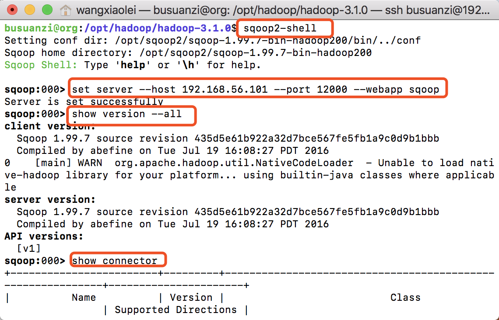
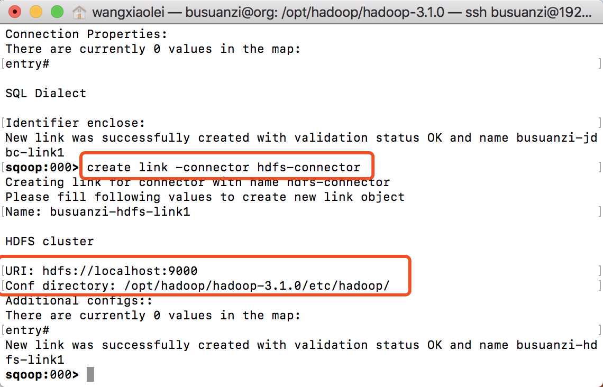
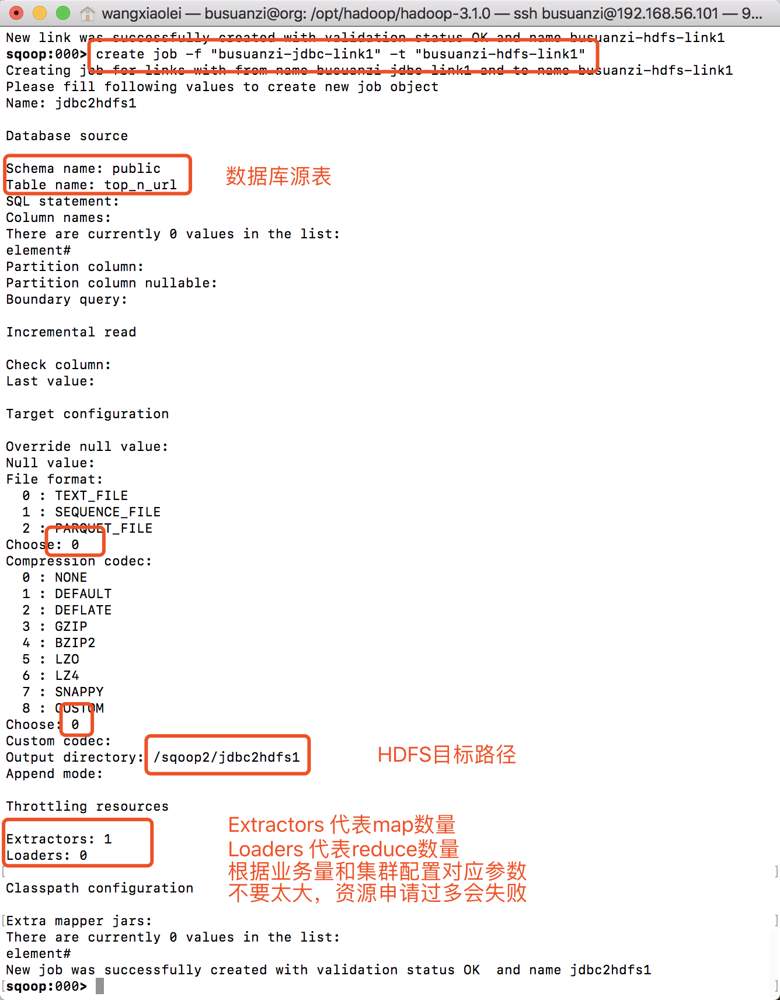
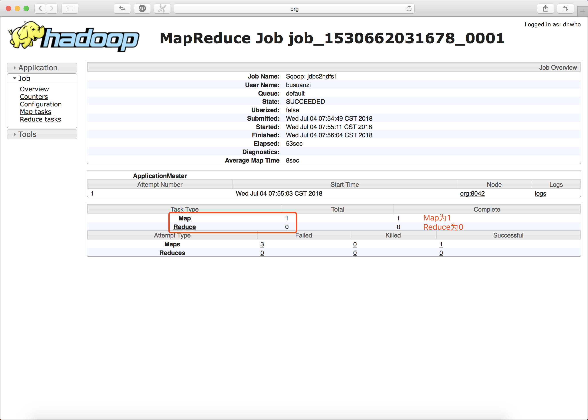
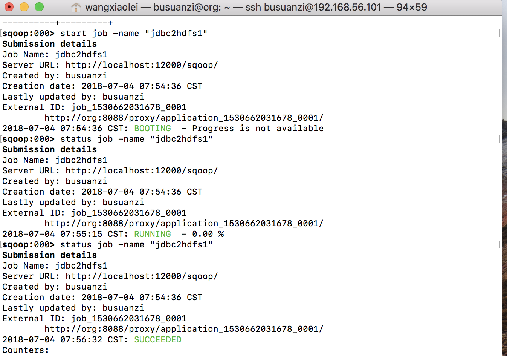
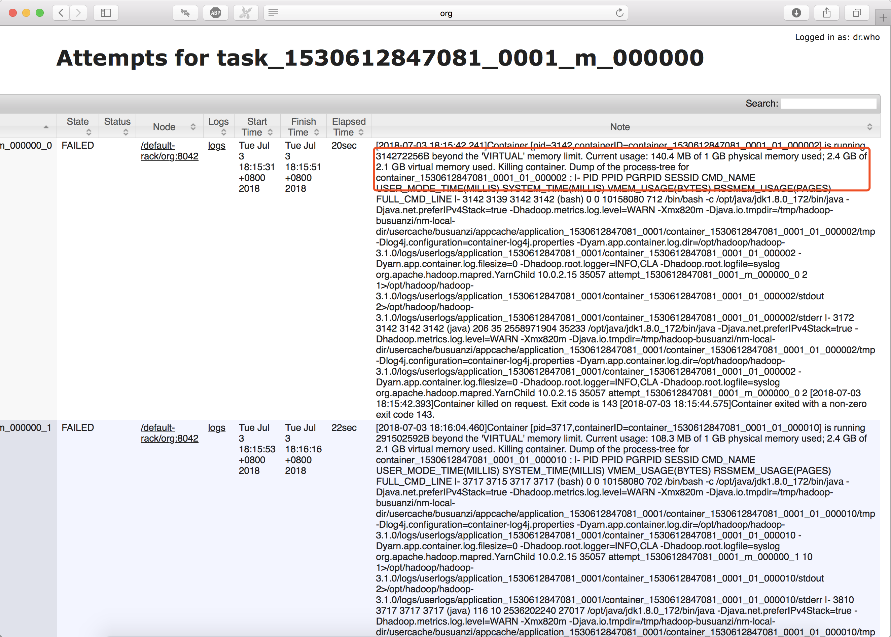
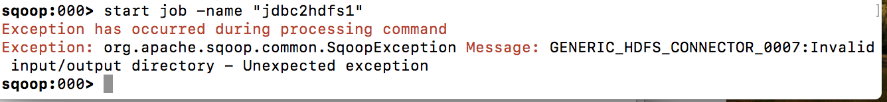

# 7.2 Sqoop2示例数据从PostgreSQL导入到HDFS

“[卜算子·大数据](https://github.com/lycheeman/big-data)”一个开源、成体系的大数据学习教程。——每周日更新

本节主要内容：

- 创建源数据PostgresSQL表与目标数据文件
- 设置Sqoop2 server
- 创建HDFS link，jdbc link
- 创建job，执行job

## 7.3.1 开启Hadoop集群
```sh
sbin/start-dfs.sh
sbin/start-yarn.sh
bin/mapred --daemon start historyserver
```

## 7.3.2 创建数据源和目标数据——PostgreSQL关系型数据库

**PostgreSQL** 创建表并插入数据
```SQL
CREATE TABLE "public"."top_n_url" (
  "url" varchar(255) NOT NULL,
  "star_number" int4,
  "comment_number" int4,
  PRIMARY KEY ("url")
)
;
```

```SQL
INSERT INTO top_n_url(url, star_number, comment_number)
      VALUES ('https://github.com/lycheeman/big-data', 1299, 789);
INSERT INTO top_n_url(url, star_number, comment_number)
      VALUES ('https://busuanzi.org', 879, 789);
INSERT INTO top_n_url(url, star_number, comment_number)
      VALUES ('https://blog.csdn.net/dream_an/article/details/80854827', 888, 652);
```
**HDFS** 创建数据目标路径
```sh
hadoop fs -mkdir -p /sqoop2/jdbc2hdfs1
```

## 7.3.3 设置Sqoop2 server
```sh
sqoop2-server start
sqoop2-shell
```

```sh
set server --host 192.168.56.101 --port 12000 --webapp sqoop
show version --all
```



```sh
show connector
```

## 7.3.4 创建JDBC连接
```sh
sqoop:000> create link -connector generic-jdbc-connector
```


## 7.3.5 创建HDFS连接
```sh
sqoop:000> create link -connector hdfs-connector
```



```sh
show link
```

## 7.3.6 创建Job任务

```sh
sqoop:000> create job -f "busuanzi-jdbc-link1" -t "busuanzi-hdfs-link1"
```



## 7.3.7 执行job
```sh
start job -name "jdbc2hdfs1"
```


http://192.168.56.101:19888/jobhistory/




:clap:本节完成

长按关注**从入门到精通**


**开源、源码获取**   https://github.com/lycheeman/big-data


---
（下划线以下部分可忽略）

:izakaya_lantern:**拓展部分**

:izakaya_lantern:**[Sqoop官方命令](http://sqoop.apache.org/docs/1.99.7/user/CommandLineClient.html#show-link-function)**

:izakaya_lantern: **申请的MapReduce内存大于集群提供的内存，所以任务被kill掉，执行失败。**

sqoop2 job failed with status 3 或者 is running 314272256B beyond the 'VIRTUAL' memory limit. Current usage: 140.4 MB of 1 GB physical memory used; 2.4 GB of 2.1 GB virtual memory used. Killing container.



解决：在创建job时，设定map、reduce的数量小一些，比如：

- Extractors:1
- Loaders:0

表示，map数量为1，reduce数量为0

:izakaya_lantern:**执行文件写入权限认证问题**

Exception has occurred during processing command
Exception: org.apache.sqoop.common.SqoopException Message: GENERIC_HDFS_CONNECTOR_0007:Invalid input/output directory - Unexpected exception


**解决**

 添加core-site.xml如下配置，并重启集群生效。
 ```xml
 <property>
   <name>hadoop.proxyuser.busuanzi.hosts</name>
   <value>*</value>
 </property>
 <property>
   <name>hadoop.proxyuser.busuanzi.groups</name>
   <value>*</value>
 </property>
```


:izakaya_lantern:**创建JDBC连接明细**

```sh
sqoop:000> create link -connector generic-jdbc-connector
Creating link for connector with name generic-jdbc-connector
Please fill following values to create new link object
Name: busuanzi-jdbc-link1

Database connection

Driver class: org.postgresql.Driver
Connection String: jdbc:postgresql://192.168.56.110:5432/busuanzidb
Username: busuanzi
Password: ******
Fetch Size:
Connection Properties:
There are currently 0 values in the map:
entry#

SQL Dialect

Identifier enclose:
New link was successfully created with validation status OK and name busuanzi-jdbc-link1
```

:izakaya_lantern:**创建HDFS连接明细**
```sh
sqoop:000> create link -connector hdfs-connector
Creating link for connector with name hdfs-connector
Please fill following values to create new link object
Name: busuanzi-hdfs-link1

HDFS cluster

URI: hdfs://localhost:9000
Conf directory: /opt/hadoop/hadoop-3.1.0/etc/hadoop/
Additional configs::
There are currently 0 values in the map:
entry#
New link was successfully created with validation status OK and name busuanzi-hdfs-link1
```


:izakaya_lantern:**创建job明细**

```sh
sqoop:000> create job -f "busuanzi-jdbc-link1" -t "busuanzi-hdfs-link1"
Creating job for links with from name busuanzi-jdbc-link1 and to name busuanzi-hdfs-link1
Please fill following values to create new job object
Name: jdbc2hdfs1

Database source

Schema name: public
Table name: top_n_url
SQL statement:
Column names:
There are currently 0 values in the list:
element#
Partition column:
Partition column nullable:
Boundary query:

Incremental read

Check column:
Last value:

Target configuration

Override null value:
Null value:
File format:
  0 : TEXT_FILE
  1 : SEQUENCE_FILE
  2 : PARQUET_FILE
Choose: 0
Compression codec:
  0 : NONE
  1 : DEFAULT
  2 : DEFLATE
  3 : GZIP
  4 : BZIP2
  5 : LZO
  6 : LZ4
  7 : SNAPPY
  8 : CUSTOM
Choose: 0
Custom codec:
Output directory: /sqoop2/jdbc2hdfs1
Append mode:

Throttling resources

Extractors: 1
Loaders: 0

Classpath configuration

Extra mapper jars:
There are currently 0 values in the list:
element#
New job was successfully created with validation status OK  and name jdbc2hdfs1
```
