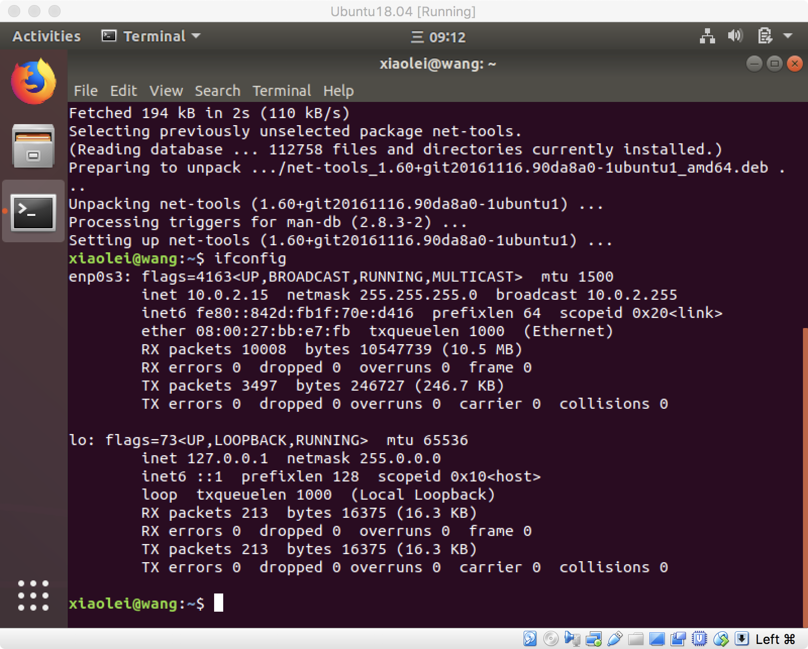
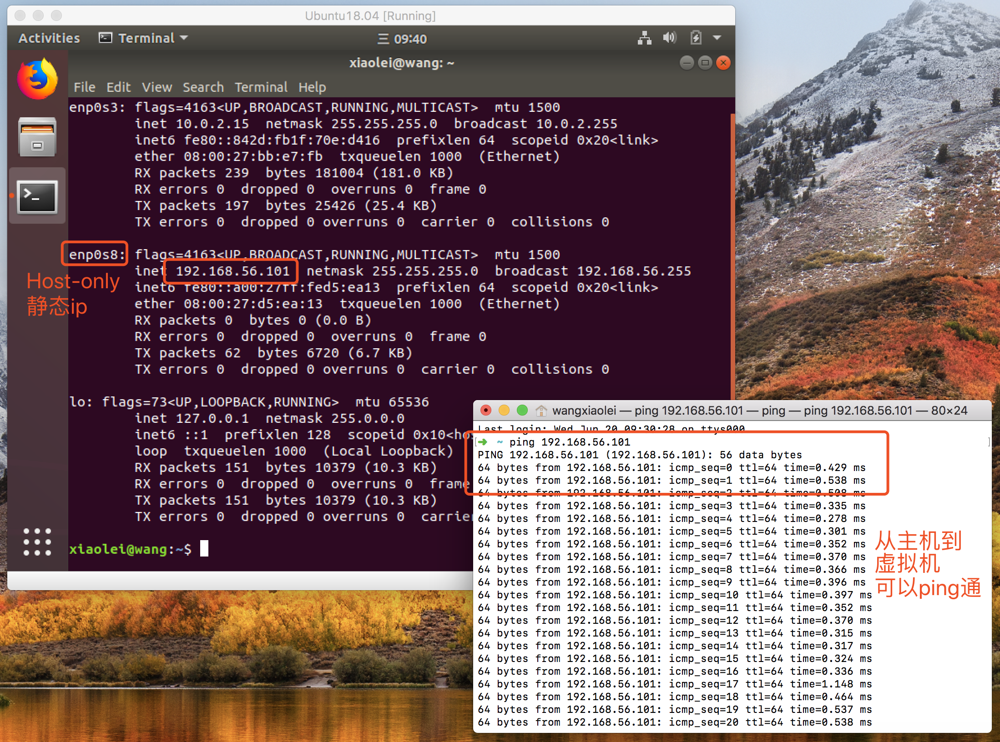
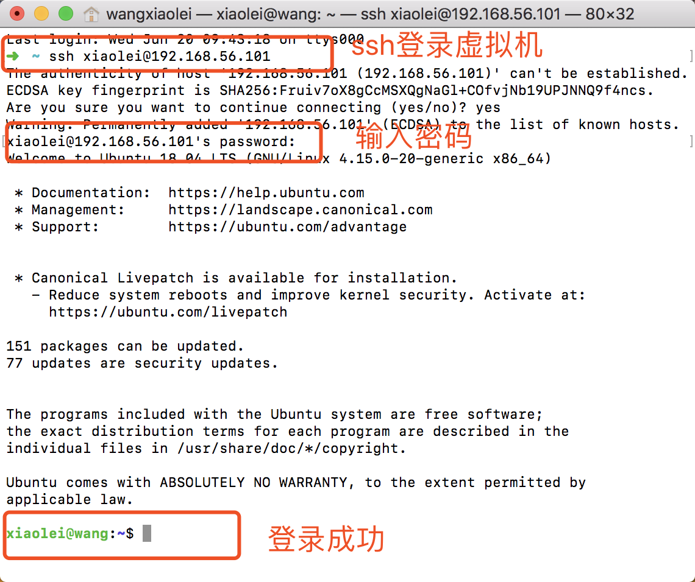
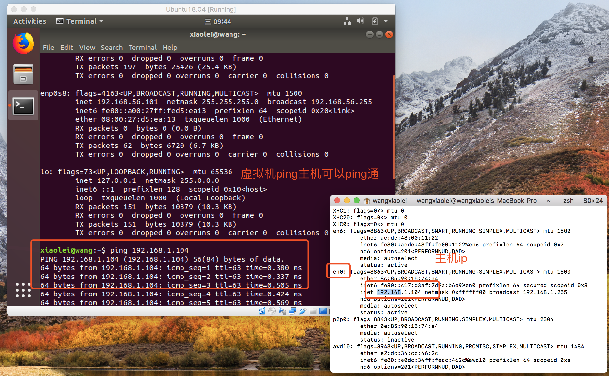
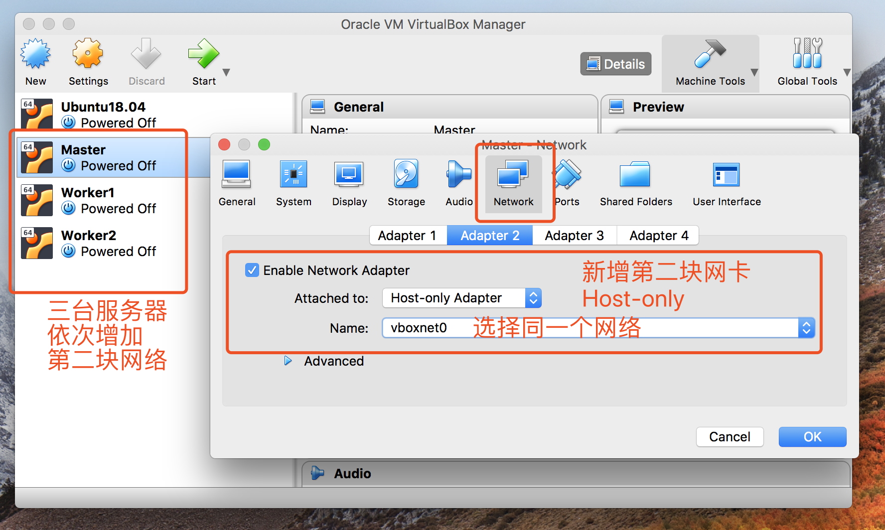
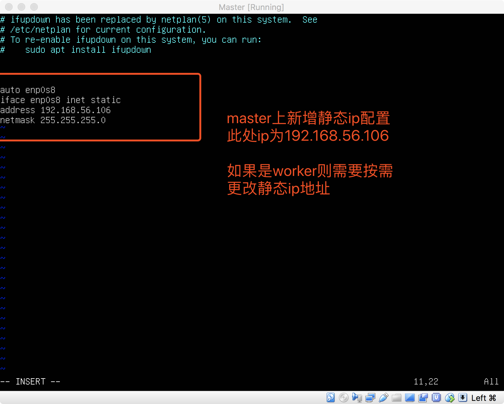

# 1.3 virtualbox高级应用构建本地大数据集群服务器

>开源地址 https://github.com/lycheeman/big-data

[卜算子·大数据 目录](./../../README.md)

>开源“卜算子·大数据”系列文章、源码，面向大数据（分布式计算）的编程、应用、架构——每周更新！Linux、Java、Hadoop、Spark、Sqoop、hive、pig、hbase、zookeeper、Oozie、flink...etc

本节主要讲解内容：
- 如何通过virtualbox构建“真正”的服务器
- virtualbox网络设置，使得的主机与虚拟机，虚拟机与虚拟机互相登录。
- 搭建三台可以互通linux服务器版本的虚拟机，主机也可以登录到任意一台虚拟机上。
- 关于Ubuntu环境下如何设置virtualbox网络可以查看我之前的一篇文章[VirtualBox NAT host-only高级网络配置](https://blog.csdn.net/dream_an/article/details/68484911)
上一节1.1已经讲解了如何来快速安装、配置virtualbox，并已经安装了Ubuntu18.04桌面版，如果不清楚步骤请查看[1.1 Virtualbox虚拟机快速入门](./1.1Virtualbox虚拟机快速入门.md)


## 1.3.1 设置virtualbox的网络（以Mac为例，其他平台大同小异）

file-->Host Network Manager-->Create-->查看分配的网段并取消DHCP


至此就已经设置好了host-only所需的网段了。

## 1.3.2 配置虚拟机静态ip，设置虚拟机中的Ubuntu桌面版的网络，可以让主机与虚拟机之间互动。

### 1.3.2.1 首先开启、并查看已有的桌面版网络情况


```
# 安装网络工具
sudo apt install net-tools
# 查看本地网络情况
ifconfig
```


当前网络 10.0.2.15主机是ping不通的。关闭虚拟机。

### 1.3.2.2 虚拟机Ubuntu关机，开始配置可以ping通的网络。
默认配置了NAT网络，这样可以让虚拟机连接互联网（这个需要的）


接下来配置第二块网卡，设置为Host-only模式，然后（自动）选择1.2.1设置的网络vboxnet0，保存。此时，虚拟机就具备了第二块网卡，但是因为取消了DHCP自动分配网络ip，所以需要手动的去虚拟机中配置静态ip。


### 1.3.3 配置虚拟机的静态ip，开启虚拟机，修改虚拟机本机的网络配置文件。

开启虚拟机，**最新版Ubuntu18.04** 网络配置需要安装ifupdown使得修改生效
```
sudo apt install ifupdown
```

查看当前网络
```
ls /sys/class/net
```
修改网络配置文件
```
sudo vim /etc/network/interfaces
```
添加如下内容
```
# 增加的Host-only静态IP设置 (enp0s8 是根据拓扑关系映射的网卡名称（旧规则是eth0,eth1）)
# 可以通过 ```ls /sys/class/net```查看，是否为enp0s8
auto enp0s8
iface enp0s8 inet static
address 192.168.56.101
netmask 255.255.255.0
```


 **重启虚拟机生效。**

### 1.3.4 配置完成静态ip后，主机与虚拟机可以相互ping通

```
#linux、mac查看本机ip
ifconfig
# window用ipconfig
```

### 1.3.4.1 主机ping虚拟机


### 1.3.4.2 **主机登录虚拟机**（重要是这里，这样可以通过主机就可以直接登录虚拟机操作了），其实就是你本地机器登录服务器的场景（即本地登录上到云服务器）
```
sudo apt install openssh-server
```


### 1.3.4.3 虚拟机ping主机



## 1.3.5 安装三台服务器版Ubuntu(Ubuntu18.04 server),为大数据集群做准备。

### 1.3.5.1 virtualbox创建三台虚拟机分别为Master、Worker1、Worker2

- 配置1. 内存分别为2G，磁盘空间为20G。
- 配置2. 添加第二块网卡，即增加Host-only网络。



### 1.3.5.2 分别安装server版的Ubuntu18.04系统。

- [点击下载服务器版镜像](https://mirrors.tuna.tsinghua.edu.cn/ubuntu-releases/18.04/ubuntu-18.04-live-server-amd64.iso)

- 服务器安装过程注意事项
  - 设置主机名称，比如master，就该设置成master，worker1，就设置成worker1
  - 设置用户名称，统一设置为hadoop用户，username需要相同，同一用户可以解决涉及到权限和登录问题。
  - 若查看详细的安装步骤，请[查看完整安装记录图片](./../image/chapter1/1.3/install-ubuntu-18.04-server-6.png)（install-ubuntu-18.04-server-1.png 从1到8）


至此安装完成，接下来修改虚拟机的网络配置文件。

### 1.3.5.3 修改服务器版网络配置文件，支持，主机与虚拟机，虚拟机与虚拟机（服务器与服务器）互通（此处以master为例，可按照此步骤依次更改）。

- ip分配
  - master  静态ip配置为 192.168.56.106
  - worker1 静态ip配置为 192.168.56.107
  - worker2 静态ip配置为 192.168.56.108

例如：修改master网络配置文件，设置静态ip为 192.168.56.106


**最新版Ubuntu18.04** 网络配置需要安装ifupdown使得修改生效
```
sudo apt install ifupdown
```


```
sudo vim /etc/network/interfaces
```

添加如下内容

```
# (注释的内容忽略)增加的Host-only静态IP设置 (enp0s8 是根据拓扑关系映射的网卡名称（旧规则是eth0,eth1）)
# 可以通过 ```ls /sys/class/net```查看，是否为enp0s8

auto enp0s8
iface enp0s8 inet static
address 192.168.56.106
netmask 255.255.255.0
```




**重启生效，如此依次更改其他服务器**


### 1.3.6 **最终**

三台虚拟服务器，可以通过本地登录，并执行操作。

至此完成虚拟机高级教程，已经可以通过虚拟机搭建“真正”的服务器了。

就开始真正的大数据之旅吧。


> 开源地址：https://github.com/lycheeman/big-data

大数据完整知识体系原创分享，长按关注微信公众号【从入门到精通】，进群交流、获取一手更新资讯。


