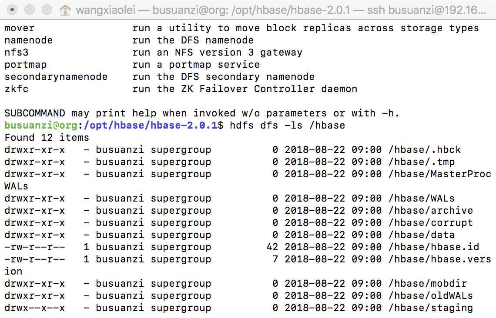

# Hbase2.1.0伪分布式部署
Hbase伪分布式部署，前提是已经部署好了Hadoop伪分布式，并且已经开启HDFS。
## 1.下载Hbase
https://mirrors.tuna.tsinghua.edu.cn/apache/hbase/
## 2.解压，放置/opt/hbase文件下
## 3.修改配置文件
a.修改配置文件conf/hbase-site.xml
```xml
<configuration>
  <property>
        <name>hbase.cluster.distributed</name>
        <value>true</value>
  </property>
  <property>
    <name>hbase.rootdir</name>
    <value>hdfs://localhost:9000/hbase</value>
  </property>
  <property>
    <name>hbase.zookeeper.property.dataDir</name>
    <value>/home/busuanzi/hbase/zookeeper</value>
  </property>
  <property>
    <name>hbase.unsafe.stream.capability.enforce</name>
    <value>false</value>
    <description>
      Controls whether HBase will check for stream capabilities (hflush/hsync).

      Disable this if you intend to run on LocalFileSystem, denoted by a rootdir
      with the 'file://' scheme, but be mindful of the NOTE below.

      WARNING: Setting this to false blinds you to potential data loss and
      inconsistent system state in the event of process and/or node failures. If
      HBase is complaining of an inability to use hsync or hflush it's most
      likely not a false positive.
    </description>
  </property>
</configuration>
```
b.增加JAVA_HOME，conf/hbase-env.sh

 ```sh
 export JAVA_HOME=/opt/java/jdk1.8.0_172/
 ```
## 4.在HDFS上创建hbase文件夹
```sh
hdfs dfs -mkdir /hbase
```
## 5.启动hbase
```sh
bin/start-hbase.sh
```
## 6.检查hbase部署成功
```sh
hdfs dfs -ls /hbase
```
得到如下即成功部署伪分布式hbase
```sh
busuanzi@org:/opt/hbase/hbase-2.0.1$ hdfs dfs -ls /hbase
Found 12 items
drwxr-xr-x   - busuanzi supergroup          0 2018-08-22 09:00 /hbase/.hbck
drwxr-xr-x   - busuanzi supergroup          0 2018-08-22 09:00 /hbase/.tmp
drwxr-xr-x   - busuanzi supergroup          0 2018-08-22 09:00 /hbase/MasterProcWALs
drwxr-xr-x   - busuanzi supergroup          0 2018-08-22 09:00 /hbase/WALs
drwxr-xr-x   - busuanzi supergroup          0 2018-08-22 09:00 /hbase/archive
drwxr-xr-x   - busuanzi supergroup          0 2018-08-22 09:00 /hbase/corrupt
drwxr-xr-x   - busuanzi supergroup          0 2018-08-22 09:00 /hbase/data
-rw-r--r--   1 busuanzi supergroup         42 2018-08-22 09:00 /hbase/hbase.id
-rw-r--r--   1 busuanzi supergroup          7 2018-08-22 09:00 /hbase/hbase.version
drwxr-xr-x   - busuanzi supergroup          0 2018-08-22 09:00 /hbase/mobdir
drwxr-xr-x   - busuanzi supergroup          0 2018-08-22 09:00 /hbase/oldWALs
drwx--x--x   - busuanzi supergroup          0 2018-08-22 09:00 /hbase/staging
```

