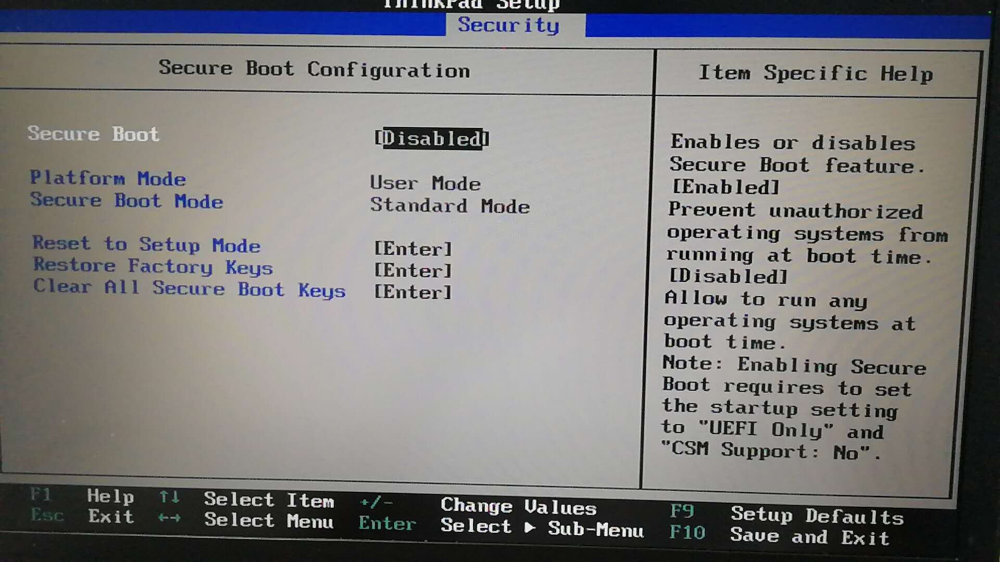

# 2.1 Virtualbox虚拟机快速入门

本节主要内容：

- BIOS设置
- Virtualbox安装
- Virtualbox Host-only网络设置
- Virtualbox安装Ubuntu18.04服务器版


### 2.1.1 关闭 Security boot(安全启动项)

不同厂商型号的计算机方案不一样，但是总之就是 关闭 Security boot，列出两个方案。

方案一：在计算机启动时进入BIOS设置(F2)——>高级模式(有的笔记本没有高级模式直接能看到“boot”)——>启动(boot)——安全启动——>密室管理——>清除密匙（至此关闭了安全启动项）

方案二：进入BIOS设置（F2）——>Security——Security boot(设置为Disabled)


### 2.1.2 设置 cup 虚拟选项为开启
不同厂商型号的计算机方案不一样，但是总之就是 开启 Intel Virtualization Technology，列出两个方案。

- 方案一：进入BIOS设置（F2）——>advanced——>cpu config——>Intel virualization Tecnology (设置为Enabled)
- 方案二：进入BIOS设置（F2)——>security——Intel Virtualization Technology （设置为Enabled）


### 2.1.3 下载Virtualbox和Linux镜像

**Virtualbox**
下载 https://www.virtualbox.org/wiki/Downloads

 - VirtualBox 5.2.12 platform packages
   - Windows hosts（window版本）
   - OS X hosts（Mac版本）
   - Linux distributions（Linux版本）
   - Solaris hosts

**Linux**
镜像（Ubuntu 18.04或者 debian9.4）

 - 下载Ubuntu18.04 服务器版（即没有桌面）
   - 下载地址 (https://mirrors.tuna.tsinghua.edu.cn/ubuntu-releases/18.04/ubuntu-18.04-live-server-amd64.iso)
   - 服务器版占用资源少，但是没有界面，需要纯命令行操作，后续大数据开发中，集群部署使用服务器版。


### 2.1.5 安装virtualbox
（安装如果有问题请看文章末尾“警告部分:warning:”）

 **Mac** 环境安装

- 安装virtualbox，如下图

  


**Linux** 环境安装（Ubuntu18.04）

- 在terminal中按顺序执行如下安装命令

```
# 安装必要依赖
sudo apt install gcc make perl

# 通过 dpkg -i 安装下载好的软件包
sudo dpkg -i virtualbox-5.2_5.2.12-122591~Ubuntu~bionic_amd64.deb

# 检查、修复安装过程发生的错误
sudo apt install -f

# 重新启动virtualbox服务
sudo /sbin/vboxconfig
```


### 2.1.6 设置Host-only网络，实现主机与虚拟机（服务器），虚拟机与虚拟机互通。


- 创建新的Host-only网络（如果有，就不用创建了）
- 取消DHCP自动分配IP设置，后续步骤会手动分配静态IP

至此完成了BIOS设置、Virtualbox的安装与网络设置。接下来安装Linux服务器版。

---

2.1.7 创建虚拟机

选好配置后，一路“默认配置继续”就行，其中内存和磁盘大小可以灵活调节。


2.1.8 安装服务器版Linux，创建busuanzi.org服务器（后续章节中用作伪分布式大数据的部署，与代码编程调试——因为在本地直接开三台虚拟机有的机器受不了，只能开单台伪分布式了）

**关键步骤设置**

- Servers name为Hostname主机名 org，主机名根据机器和用途分配不同的名字。
- username为username 用户名busuanzi，用户名需要一致。
  - 伪分布式
  busuanzi@org
  - 集群
  busuanzi@master
  busuanzi@worker1
  busuanzi@worker2


详细步骤：


Ubuntu18.04服务器版安装完成。

## 2.1.9 更新软件包、设置中国时区、解决命令行中中文乱码问题

更新软件包

```sh
sudo apt update
```

```sh
sudo apt upgrade
```

设置中国时区

```sh
sudo timedatectl set-timezone Asia/Shanghai
```
解决命令行中中文乱码问题

```bash
sudo vim /etc/environment
```

```bash
LANG=en_US.utf-8
LC_ALL=en_US.utf-8
```
---
**可忽略以下内容**

- :warning:为警告信息，如果没有遇到此类问题，可忽略不看。

- :izakaya_lantern:为附加内容，和大数据系列关系不大，可忽略不看。


:warning:初次（加载镜像）打开已经创建好的虚拟机
如果初次加载镜像报错， 确认——Security boot关闭，Intel Virtualization Technology开启

**Mac平台**
  初次加载镜像配置
  - Mac系统中报错（初次安装后，加载镜像报错，因为没有权限）


  - Mac系统中报错解决（在 System Prefences-->Security & Privacy-->General--Allow)允许virtualbox的权限操作。


:izakaya_lantern:桌面版安装记录
- 1.加载镜像


- 2.选择安装


- 3.选择语言（推荐英文，不容易出一些莫名其妙的错误）


- 4.选择最小安装，取消安装过程中更新（这样安装过程会很快，大概3-4分钟）


- 5.选择清磁盘安装


- 6.确定


- 7.选择时区


- 8.设置用户名和主机名


- 9.等待。。。


- 10.安装完毕需要重启虚拟机，然后重新进入登录，安装完成


:clap:本节完成

长按关注**从入门到精通**


**开源、源码获取**   https://github.com/lycheeman/big-data
