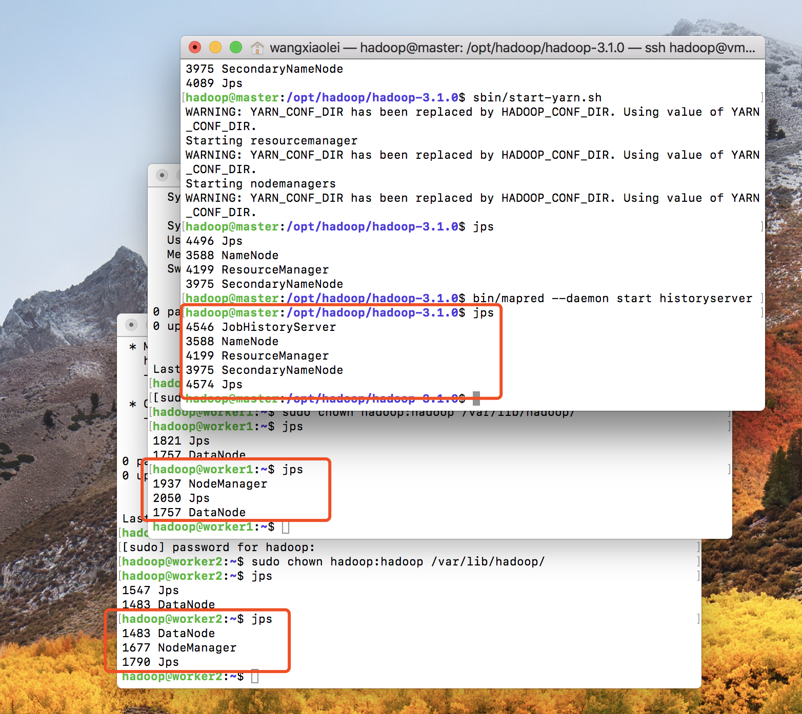
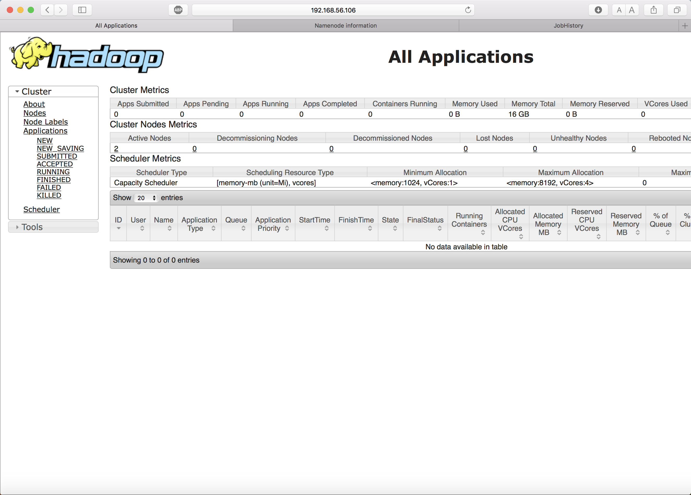
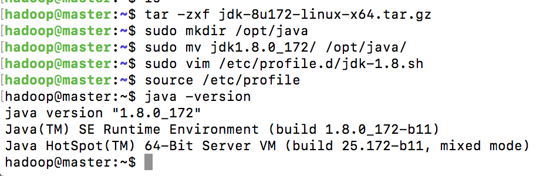
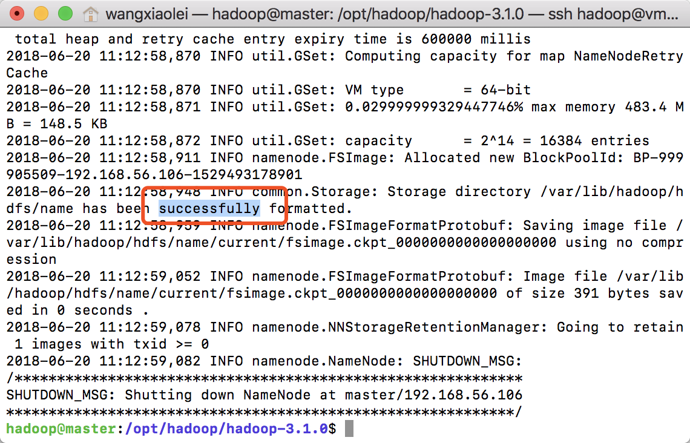
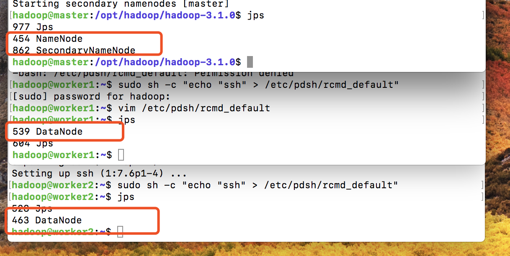

# 2.2 Hadoop3.1.0完全分布式集群配置与部署

>开源地址 https://github.com/lycheeman/big-data

[卜算子·大数据 目录](./../../README.md)

>开源“卜算子·大数据”系列文章、源码，面向大数据（分布式计算）的编程、应用、架构——每周更新！Linux、Java、Hadoop、Spark、Sqoop、hive、pig、hbase、zookeeper、Oozie、flink...etc

本节主要内容：

- 前提
  - 你已经拥有了三台linux版大数据集群服务器
  - 请看如何构建三台大数据集群服务器[1.3.virtualbox高级应用构建本地大数据集群服务器](./../chapter2/1.3.virtualbox高级应用构建本地大数据集群服务器.md)
- Hadoop3.1.0最新版本完全分布式集群服务器的配置与部署
- 配置Java环境
- 配置免登陆
- 配置hadoop核心文件
- 格式化集群
- 开启集群
- 关闭集群




## 2.2.1 Java环境配置、安装
通过wget下载linux版jdk
```bash
wget --no-check-certificate --no-cookies --header "Cookie: oraclelicense=accept-securebackup-cookie" http://download.oracle.com/otn-pub/java/jdk/8u172-b11/a58eab1ec242421181065cdc37240b08/jdk-8u172-linux-x64.tar.gz
```
Java解压缩、移动到/opt/java/路径下
```bash
#解压
tar -zxf
# 移动至/opt/java 下
tar -zxf jdk-8u172-linux-x64.tar.gz
sudo mkdir -p /opt/java
sudo mv jdk1.8.0_172/ /opt/java/
```
添加java环境变量
```bash
sudo vim /etc/profile.d/jdk-1.8.sh
```

添加如下内容
```sh
#!/bin/sh
# Author:wangxiaolei 王小雷
# Github: https://github.com/lycheeman

export JAVA_HOME=/opt/java/jdk1.8.0_172
export JRE_HOME=${JAVA_HOME}/jre
export CLASSPATH=.:${JAVA_HOME}/lib:${JRE_HOME}/lib
export PATH=${JAVA_HOME}/bin:$PATH
```
Java环境变量生效
```shell
source /etc/profile
```
查看Java
```bash
java -version
```


**Java配置过程结束，按此依次配置其他服务器**

## 2.2.2 免登陆配置
- **三台服务器操作**

安装必要依赖
```bash
sudo apt install ssh
sudo apt install pdsh
```

配置Keygen
```bash
# 输入以下命令，一路回车完成
ssh-keygen -t rsa
```
修改hosts配置文件
```bash
sudo vim /etc/hosts
```


- **Master主机服务器操作**

master免密登录到worker中
```bash
ssh-copy-id -i ~/.ssh/id_rsa.pub master
ssh-copy-id -i ~/.ssh/id_rsa.pub worker1
ssh-copy-id -i ~/.ssh/id_rsa.pub worker2
```
查看登录情况，此时不需要输入密码，就可以从Master登录到worker
```bash
ssh worker1
```

## 2.2.3 Hadoop核心文件配置

- 可以在本地修改好配置文件后，然后将Hadoop复制到集群服务器中。
- 也可以直接在服务器中修改，完成后然后复制到其他集群中。
- 核心文件共6个文件需要修改，分别是 hadoop-env.sh,core-site.xml, hdfs-site.xml, yarn-site.xml, mapred-site.xml和workers。

下载hadoop3.1.0压缩包
```bash
wget https://mirrors.tuna.tsinghua.edu.cn/apache/hadoop/common/hadoop-3.1.0/hadoop-3.1.0.tar.gz
```
```bash
tar -zxf hadoop-3.1.0.tar.gz
cd hadoop-3.1.0/etc/hadoop
```
- 1.etc/hadoop/hadoop-env.sh

修改hadoop-env.sh文件
```bash
vim hadoop-env.sh
```

添加如下内容
```bash
export JAVA_HOME=/opt/java/jdk1.8.0_172/
```

- 2.etc/hadoop/core-site.xml

```bash
vim core-site.xml
```

```xml
<configuration>

  <property>
      <name>fs.defaultFS</name>
      <value>hdfs://master:9000</value>
  </property>

  <property>
      <name>io.file.buffer.size</name>
      <value>131072</value>
  </property>

</configuration>
```
- 3.etc/hadoop/hdfs-site.xml

```bash
vim hdfs-site.xml
```

```xml
<configuration>

    <!-- Configurations for NameNode: -->
    <property>
      <name>dfs.namenode.name.dir</name>
      <value>/var/lib/hadoop/hdfs/name/</value>
    </property>

    <property>
      <name>dfs.blocksize</name>
      <value>268435456</value>
    </property>

    <property>
      <name>dfs.namenode.handler.count	</name>
      <value>100</value>
    </property>

    <!-- Configurations for DataNode: -->

    <property>
      <name>dfs.datanode.data.dir</name>
      <value>/var/lib/hadoop/hdfs/data/</value>
    </property>

    <property>
        <name>dfs.replication</name>
        <value>1</value>
    </property>

</configuration>
```

- 4.etc/hadoop/yarn-site.xml

```bash
vim yarn-site.xml
```

```xml
<configuration>

  <!-- Site specific YARN configuration properties -->

  <!-- Configurations for ResourceManager and NodeManager: -->

  <!-- Configurations for ResourceManager: -->
    <property>
            <name>yarn.resourcemanager.hostname</name>
            <value>master</value>
    </property>
    <property>
        <name>yarn.nodemanager.env-whitelist</name>
        <value>JAVA_HOME,HADOOP_COMMON_HOME,HADOOP_HDFS_HOME,HADOOP_CONF_DIR,CLASSPATH_PREPEND_DISTCACHE,HADOOP_YARN_HOME,HADOOP_MAPRED_HOME</value>
    </property>
    <!-- 配置外网只需要替换外网ip为真实ip，否则默认为 localhost:8088 -->
    <!-- <property>
            <name>yarn.resourcemanager.webapp.address</name>
            <value>外网ip:8088</value>
    </property> -->
  <!-- Configurations for NodeManager: -->
    <property>
            <name>yarn.nodemanager.aux-services</name>
            <value>mapreduce_shuffle</value>
    </property>
  <!-- Configurations for History Server (Needs to be moved elsewhere): -->
</configuration>
```

- 5.etc/hadoop/mapred-site.xml

```bash
vim mapred-site.xml
```

```xml
<configuration>
  <!-- Configurations for MapReduce Applications: -->
  <property>
       <name>mapreduce.framework.name</name>
       <value>yarn</value>
   </property>
   <property>
     <name>mapreduce.application.classpath</name>
     <value>$HADOOP_MAPRED_HOME/share/hadoop/mapreduce/*:$HADOOP_MAPRED_HOME/share/hadoop/mapreduce/lib/*</value>
   </property>
</configuration>
```
- 6.etc/hadoop/workers

修改workers文件
```bash
vim workers
```
删除原本的localhost，新增集群worker

```txt
worker1
worker2
```

## 2.2.4 将配置好的Hadoop文件发送到每一个集群

在master操作，master发送至worker1,worker2
```bash
scp -r hadoop-3.1.0 worker1:/home/hadoop/
scp -r hadoop-3.1.0 worker2:/home/hadoop/
```
在三台主机中操作
```bash
sudo mkdir -p /opt/hadoop
sudo mv hadoop-3.1.0 /opt/hadoop/
```
```bash
# 新建rcmd_default文件
# 设置rcmd_default入口，避免出现 master: rcmd: socket: Permission denied
sudo sh -c "echo "ssh" > /etc/pdsh/rcmd_default"
```

## 2.2.5 Hadoop环境变量配置
在 **三台** 服务器上操作如下
- 设置环境的编码

```bash
sudo vim /etc/environment
```

增加如下内容，解决```Tab```报错，命令行中中文乱码问题
```bash
LANG=en_US.utf-8
LC_ALL=en_US.utf-8
```

- 设置Hadoop环境变量

```bash
sudo vim /etc/profile.d/hadoop-3.1.0.sh
```

```bash
#!/bin/sh
# Author:wangxiaolei 王小雷
# Github: https://github.com/lycheeman

export HADOOP_HOME="/opt/hadoop/hadoop-3.1.0"
export PATH="$HADOOP_HOME/bin:$PATH"
export HADOOP_CONF_DIR=$HADOOP_HOME/etc/hadoop
export YARN_CONF_DIR=$HADOOP_HOME/etc/hadoop
```

```bash
source /etc/profile
```

## 2.2.6 Hadoop完全分布式集群格式化
在 **三台** 主机上操作：在hdfs-site.xml中指定的hdfs文件路径，先创建出来,并把root改为hadoop，使得hadoop有读写权限
```bash
sudo mkdir /var/lib/hadoop

sudo chown hadoop:hadoop /var/lib/hadoop/
```

**只在master上操作**
```bash
cd /opt/hadoop/hadoop-3.1.0/

# 开始格式化
bin/hdfs namenode -format busuanzi
```



## 2.2.7 Hadoop完全分布式集群开启

开启所有HDFS进程
```bash
sbin/start-dfs.sh
# 查看
jps
```


开启所有yarn进程
```bash
sbin/start-yarn.sh
# 查看
jps
```


开启
```bash
bin/mapred --daemon start historyserver
# 查看
jps
```
**最终集群如下图**


## 2.2.8 通过web端查看

此处的web端集群情况查看的ip，为master的服务器ip。

### 1.ResourceManager http://192.168.56.106:8088/


### 2.NameNode http://192.168.56.106:9870/


### 3.MapReduce JobHistory Server http://192.168.56.106:19888/


## 2.2.9 Hadoop完全分布式集群关闭
**在Master上操作**

关闭HDFS进程
```bash
sbin/stop-dfs.sh
```
关闭YARN
```bash
sbin/stop-yarn.sh
```
关闭MapReduce JobHistory 服务
```bash
bin/mapred --daemon stop historyserver
```
## 2.2.10 完全、干净、彻底删除集群【谨慎操作】

```bash
# 删除HDFS文件
sudo rm -rf /var/lib/hadoop
# 删除日志文件
sudo rm -rf /opt/hadoop/hadoop-3.1.0/logs/
# 删除hadoop文件
sudo rm -rf /opt/hadoop/hadoop-3.1.0/
# 删除hadoop环境变量
sudo rm -rf /etc/profile.d/hadoop-3.1.0.sh
```

恭喜，至此，已经拥有了标准的完全分布式大数据集群环境了，你已经走进了大数据。开始探索大数据生态的奇妙之旅。一步一步来，大数据真没那么难。

> 开源地址：https://github.com/lycheeman/big-data

大数据完整知识体系原创分享，长按关注微信公众号【从入门到精通】，进群交流、获取一手更新资讯。


