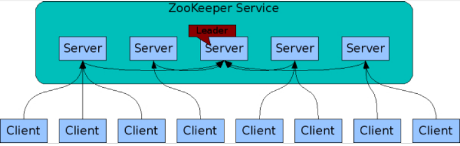
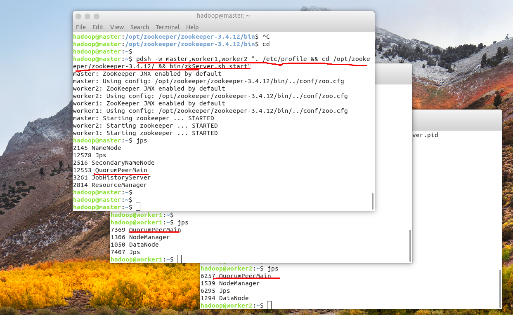
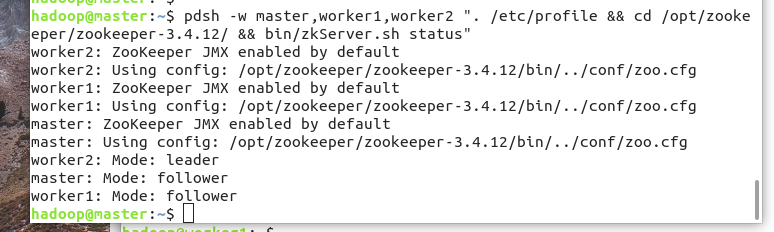

# 3.1 Zookeeper集群快速安装、部署

>开源地址 https://github.com/lycheeman/big-data

[卜算子·大数据 目录](./../README.md)

>开源“卜算子·大数据”系列文章、源码，面向大数据（分布式计算）的编程、应用、架构——每周更新！Linux、Java、Hadoop、Spark、Sqoop、hive、pig、hbase、zookeeper、Oozie、flink...etc

本节主要内容：

- Zookeeper简介
- 下载、配置、分发Zookeeper文件
- 创建Zookeeper文件、myid
- 基于pdsh启动Zookeeper
- 基于pdsh关闭Zookeeper

## 3.1.1.　Zookeeper简介
Zookeeper是一个分布式应用程序的开源的分布式协调服务，它公开了一组简单的基元，分布式应用程序可以利用这些基元来实现更高级别的服务，以实现同步，配置维护以及组和命名。ZooKeeper背后的动机是减轻分布式应用程序从头开始实施协调服务的责任。



特点：
- 简单
- 可复制
- 可订阅
- 快速的

## 3.1.2. 下载、解压[在master上操作]

下载

```sh
wget https://mirrors.tuna.tsinghua.edu.cn/apache/zookeeper/zookeeper-3.4.12/zookeeper-3.4.12.tar.gz
```

解压

```sh
tar -zxf zookeeper-3.4.12.tar.gz
```


## 3.1.3. 配置Zookeeper[源码](./../)
```sh
cd zookeeper-3.4.12/conf/
vim zoo.cfg
```
修改zoo.cf为如下内容

```cfg
tickTime=2000
dataDir=/var/lib/zookeeper
dataLogDir=/var/lib/zookeeper/logs
clientPort=2181
initLimit=5
syncLimit=2
server.1=master:2888:3888
server.2=worker1:2888:3888
server.3=worker2:2888:3888
```
**　注意　** master、worker1、worker2分别是在/etc/hosts中已经定义好的集群hostname


## 3.1.4. 将文件远程复制的到其他集群服务器上

[master]
复制master上的Zookeeper到其他服务器
```sh
scp -r  zookeeper-3.4.12 hadoop@worker1:/home/hadoop/
scp -r  zookeeper-3.4.12 hadoop@worker2:/home/hadoop/
```
[三台服务器]
```sh
sudo mkdir /opt/zookeeper
sudo mv zookeeper-3.4.12 /opt/zookeeper
```

## 3.1.5. 创建对应的文件
[三台服务器]
```sh
sudo mkdir /var/lib/zookeeper
sudo chown hadoop:hadoop /var/lib/zookeeper/
```
分别在不同的大数据服务器上添加myid
[master]
```sh
echo  "1" > /var/lib/zookeeper/myid
```
[worker1]
```sh
echo  "2" > /var/lib/zookeeper/myid
```
[worker2]
```sh
echo  "3" > /var/lib/zookeeper/myid
```


## 3.1.6. 配置Zookeeper变量

```sh
sudo vim /etc/profile.d/zookeeper-3.sh
```
添加如下内容
```sh
#!/bin/sh
# Author:wangxiaolei 王小雷
# Github:https://github.com/lycheeman

export ZOOKEEPER_HOME=/opt/zookeeper/zookeeper-3.4.12
export PATH=$PATH:$ZOOKEEPER_HOME/bin:$ZOOKEEPER_HOME/conf
```

```sh
source /etc/profile
```

## 3.1.7. 通过pdsh启动全部Zookeeper服务
[master上操作]
开启Zookeeper集群服务
```sh
pdsh -w master,worker1,worker2 ". /etc/profile && cd /opt/zookeeper/zookeeper-3.4.12/ && bin/zkServer.sh start"
```
查看
```sh
jps
```


通过status查看leader选举状态，可见worker2被选为leader。
```sh
pdsh -w master,worker1,worker2 ". /etc/profile && cd /opt/zookeeper/zookeeper-3.4.12/ && bin/zkServer.sh status"
```


## 3.1.8. 关闭Zookeeper集群

```sh
pdsh -w master,worker1,worker2 ". /etc/profile && cd /opt/zookeeper/zookeeper-3.4.12/ && bin/zkServer.sh stop"
```

至此，Zookeeper快速配置、部署完成，Zookeeper为Hadoop、Hbase等等分布式应用的分布式协调服务打下了基础。
