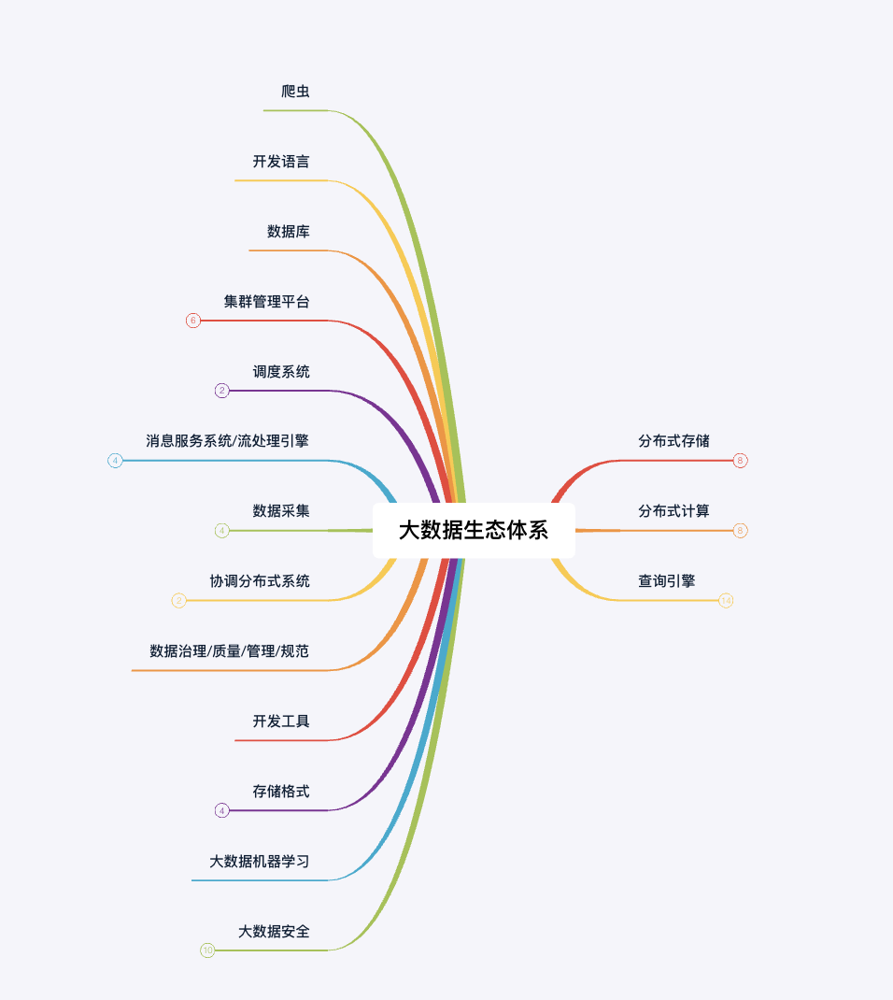
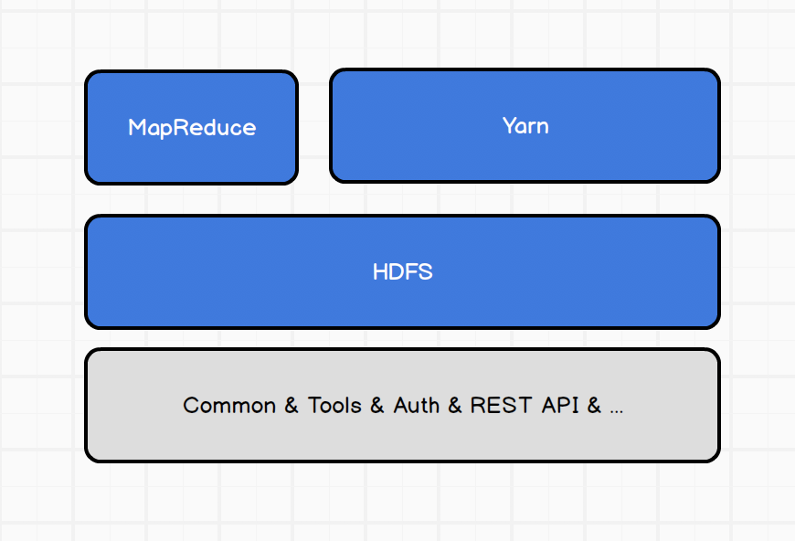
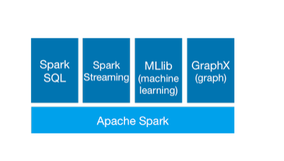
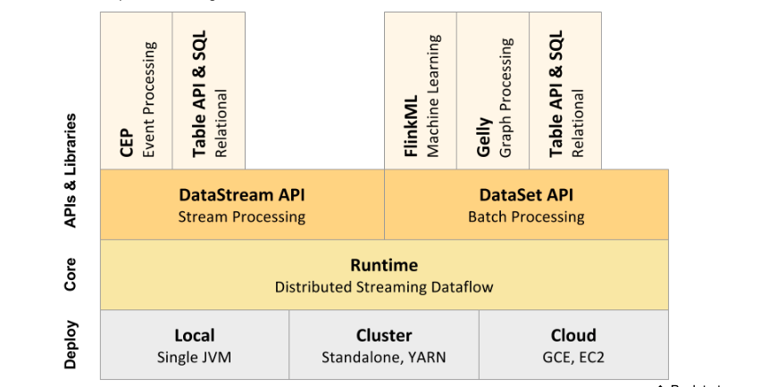

# 第11讲 - 大数据生态基础

## 1.大数据组织
软件基金会

```txt
Apache是世界使用排名第一的Web服务器软件。它可以运行在几乎所有广泛使用的计算机平台上，由于其跨平台和安全性被广泛使用，是最流行的Web服务器端软件之一。它快速、可靠并且可通过简单的API扩充，将Perl/Python等解释器编译到服务器中。同时Apache音译为阿帕奇，是北美印第安人的一个部落，叫阿帕奇族，在美国的西南部。也是一个基金会的名称、一种武装直升机等等。
```
```txt
Apache软件基金会（也就是Apache Software Foundation，简称为ASF），是专门为支持开源软件项目而办的一个非盈利性组织。在它所支持的Apache项目与子项目中，所发行的软件产品都遵循Apache许可证（Apache License）。
```

## 2.许可协议
```txt
MIT许可证（The MIT License）是许多软件授权条款中，被广泛使用的其中一种。与其他常见的软件授权条款（如GPL、LGPL、BSD）相比，MIT是相对宽松的软件授权条款。
被授权人权利
被授权人有权利使用、复制、修改、合并、出版发行、散布、再授权及贩售软件及软件的副本。
被授权人可根据程序的需要修改授权条款为适当的内容。

GPL，是GNU General Public License的缩写，是GNU通用公共授权非正式的中文翻译。它并非由自由软件基金会所发表，亦非使用GNU通用公共授权的软件的法定发布条款─只有GNU通用公共授权英文原文的版本始具有此等效力。
大多数软件许可证决意剥夺你共享和修改软件的自由。相比之下，GNU通用公共许可证试图保证你共享和修改自由软件的自由。——保证自由软件对所有用户是自由的。GPL适用于大多数自由软件基金会的软件，以及由使用这些软件而承担义务的作者所开发的软件。（自由软件基金会的其他一些软件受GNU库通用许可证的保护）。你也可以将它用到你的程序中。当我们谈到自由软件（free software）时，我们指的是自由而不是价格。

Apache License
Apache License是著名的非盈利开源组织Apache采用的协议。该协议和BSD类似，同样鼓励代码共享和尊重原作者的著作权，同样允许代码修改，再发布(作为开源或商业软件)。需要满足的条件：
* 需要给代码的用户一份Apache License
* 如果你修改了代码，需要再被修改的文件中说明
* 在延伸的代码中（修改和有源代码衍生的代码中）需要带有原来代码中的协议、商标、专利声明和其他原来作者规定需要包含的说明
* 如果再发布的产品中包含一个Notice文件，则在Notice文件中需要带有Apache License。你可以在Notice中增加自己的许可，但不可以表现为对Apache License构成更改
Apache License也是对商业应用友好的许可。使用者也可以在需要的时候修改代码来满足需要并作为开源或商业产品发布/销售。
```
[开源许可协议 编辑](https://baike.baidu.com/item/开源许可协议/2470967)


## 3.大数据生态1

大数据生态比较繁杂，主要是多场景多应用。如针对离线数仓和实时数仓有不同的大数据组件架构，落地。

大数据分布式如图：




## 4.大数据比较火的组件

[Spark](http://spark.apache.org/) 

[flink](http://flink.apache.org/)

[hadoop](http://hadoop.apache.org/)


## 5.hadoop、spark、flink概览

- hadoop概览



- spark概览




- flink概览




## 6.作业

- 1、默写spark与flink架构图
- 2、安装社区版jetbrains idea


## 7.预
- 分布式存储