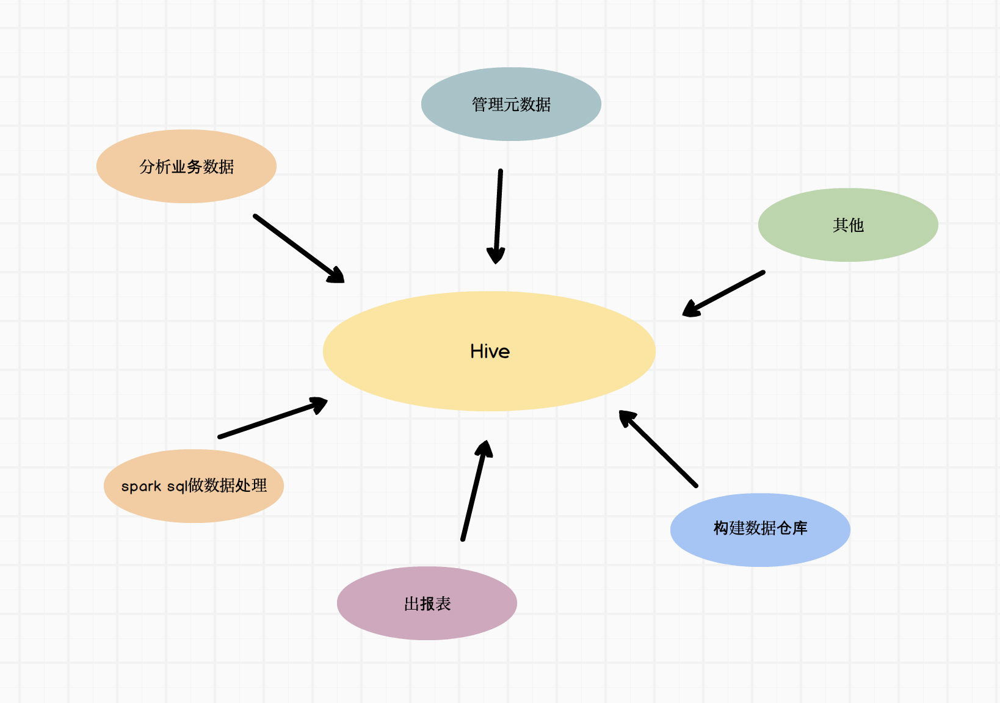

# 1. hive 使用场景

hive是基于SQL的大数据仓库工具，可以读取、写入分布式存储上的数据，对数据做管理和分析的工具。



# 2. hive 架构

hive架构如下图


# 3. SQL 基本介绍

SQL 是用于访问和处理数据库的标准的计算机语言。

sql分两种 DML和DDL，分别是数据操作语言 (DML) 和 数据定义语言 (DDL)。

## 3.1 数据操作语言（DML）
主要对表内部数据的操作，如查询和更新

```sql
SELECT - 从数据库表中获取数据
UPDATE - 更新数据库表中的数据
DELETE - 从数据库表中删除数据
INSERT INTO - 向数据库表中插入数据 
```

## 3.2 数据定义语言 (DDL)
主要是对表的和库的操作，如创建库和创建表

```sql
CREATE DATABASE - 创建新数据库
ALTER DATABASE - 修改数据库
CREATE TABLE - 创建新表
ALTER TABLE - 变更（改变）数据库表
DROP TABLE - 删除表
CREATE INDEX - 创建索引（搜索键）
DROP INDEX - 删除索引
```

## 4. select 查询操作
```sql
SELECT 列名称 FROM 表名称
```

## 5. where 条件语句

选取数据时，如果有过滤（筛选）条件，可以使用where语句
```
=	等于
<>	不等于
!=	不等于
>	大于
<	小于
>=	大于等于
<=	小于等于
BETWEEN	在某个范围内
LIKE	搜索某种模式
IN 在枚举内
```