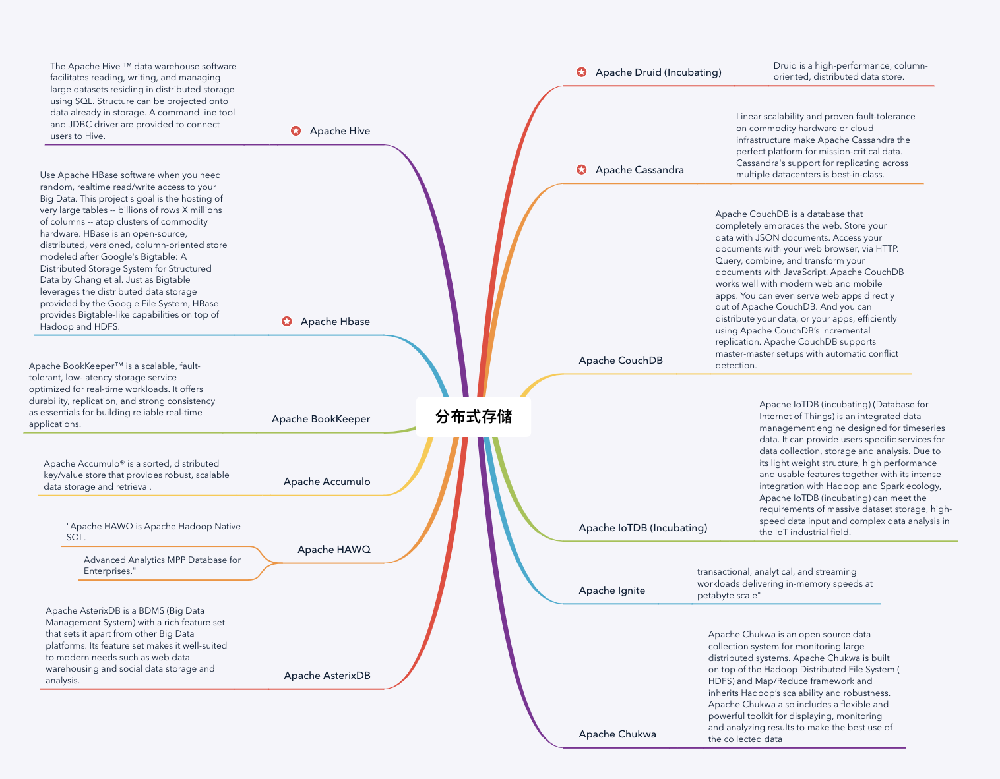

## 1.分布式存储




## 2. 安装MySQL

    ```shell
    xiaolei@wang:~$ wget https://dev.mysql.com/get/mysql-apt-config_0.8.13-1_all.deb

    xiaolei@wang:~$ sudo dpkg -i mysql-apt-config_0.8.13-1_all.deb

    xiaolei@wang:~$ sudo apt update

    xiaolei@wang:~$ sudo apt install mysql-community-server
    
    # 初次设置MySQL密码 为 wangxiaolei

    # 安装完成登入MySQL
    xiaolei@wang:~$ mysql -u root -p

    @ 先创建用户
    create user 'lay'@'%' identified by 'wangxiaolei';
    # 创建数据库
    CREATE DATABASE `db1` DEFAULT CHARACTER SET utf8 COLLATE utf8_general_ci;
    # 允许远程登录授权 *.*所有库，lay用户在%所有ip(远程登录)都可以登录
    grant all privileges on *.* to 'lay'@'%' with grant option;
    ```


